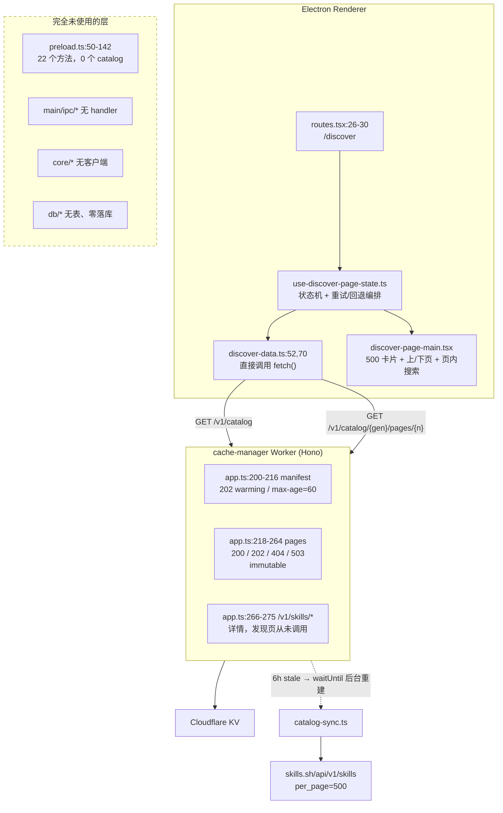

# Discover 发现页数据流 × cache-manager 契约 一致性评审

日期：2026-08-04
范围：纯分析评审，未修改任何代码或文档

---

## 1. TL;DR

发现页**已真实接入 cache-manager**（不是 mock、也不是直连 skills.sh），核心契约方向是对的：先取 manifest → 用 generation 拼分页 URL → total 以 `pagination.total` 为准 → 搜索是客户端页内过滤。

但有 **2 个 P0 + 5 个 P1** 级别的问题，其中两个最关键：

1. **数据流走错了层** —— HTTP 请求写在 renderer 里直接 `fetch()`，完全绕过 preload/IPC/core/db。spec 的 Runtime Topology 写的是 `Electron main process -> Cloudflare Worker`，且「Electron renderer 或 main process 接入」明确列在**第一版不包含**里。
2. **`Retry-After` 在 renderer 里恒为 null** —— 该头不是 CORS-safelisted 响应头，Worker 又没设 `Access-Control-Expose-Headers`。「按 Retry-After 重试」这条契约在客户端**从未真正生效**，实际恒用兜底 2s。

---

## 2. 数据流全景

关键数据：`manifest.current.generation` → 拼 URL；`manifest.current.pageCount` → 驱动分页器；`pagination.total` → 覆盖 totalCount 用于搜索框文案。

---

## 3. 逐层链路

| 层 | 文件:行 | 职责 |
|---|---|---|
| 路由 | `renderer/app/routes.tsx:20-30` | `/` 直接 Navigate 到 `/discover`，是首屏 |
| 容器 | `features/discover/discover-page.tsx:5-23` | hook → props 透传，无副作用 |
| 状态机 | `hooks/use-discover-page-state.ts:18-195` | generation 解析、202 重试、503 回退、分页、过滤 |
| ↳ generation | 同上 `:59-69` | 首次取 manifest，current 存 ref、previous 存 fallback ref |
| ↳ 单页加载 | 同上 `:75-113` | 200→setSkills；503→回退一次；202→delay 重入（`MAX_FALLBACK_ATTEMPTS=1` @ `:16`） |
| ↳ 触发 | 同上 `:153-161` | `useEffect([page, loadCycle])`，翻页 abort 上一次 |
| HTTP | `discover-data.ts:48-82` | **裸 fetch**，只识别 202/503，其余一律通用 Error |
| 配置 | `discover-data.ts:45` + `vite.config.ts:36` | 构建期注入 `DISCOVER_CATALOG_BASE_URL` |
| 展示 | `components/discover-page-main.tsx:113-117` | 一次渲染当前页全部 500 条，无虚拟滚动 |
| 分页器 | 同上 `:41-42,120-146` | 仅上/下页；**搜索时整个分页器被隐藏** |
| 详情入口 | 同上 `:199-209` | 裸 `<a target="_blank">`，未走 `openExternalUrl` |
| preload | `main/preload.ts:50-142` | 22 个方法，**0 个 catalog 相关**（已 grep 确认无匹配） |

补充：`features/discover/` 整个目录**尚未提交（untracked）**，且**零测试文件**。

---

## 4. cache-manager 侧契约（以代码为准）

| 路由 | 文件:行 | 异常语义 | 缓存头 |
|---|---|---|---|
| `GET /v1/catalog` | `app.ts:200-216` | 无 manifest → **202** + `retry-after: 2`（`:43-50`） | fresh `max-age=60`；stale `max-age=0` + 后台重建 |
| `GET /v1/catalog/:gen/pages/:page` | `app.ts:218-264` | gen 不在 current/previous **或** page ≥ pageCount **或** page 非法 → **404**（`:235-240`）；manifest 有但 KV 未传播 → **503**（`:242-252`） | `max-age=31536000, immutable` + `X-Catalog-Generation` |
| `GET /v1/skills/*` | `app.ts:266-275` | 路径非法 400；上游失败 502 | 5min fresh / 1h stale |
| `POST /internal/sync` | `app.ts:285-304` | 无 admin token → 401 | — |

- `perPage` 固定 **500**（`catalog/types.ts:2`），manifest 强制校验一致
- 上游字段全量透传，仅强校验 `typeof skill.id === "string"`（`sync/catalog-client.ts:59`）—— **无 description、无日期字段**
- CORS（`app.ts:136-139`）只设了 Allow-Origin / Allow-Methods / Allow-Headers / Max-Age，**无 Expose-Headers**（已核实）
- **无任何搜索路由**，与 spec 一致

---

## 5. 一致性比对

### ✅ 一致（7 条）

| # | 结论 | 证据 |
|---|---|---|
| A1 | 不硬编码 generation，先取 manifest | `use-discover-page-state.ts:63-64` |
| A2 | 分页 URL 形态对齐，n 从 0 起 | `discover-data.ts:70`；`hooks:27` |
| A3 | total 以 `pagination.total` 为准，覆盖 manifest | `hooks:85-87` |
| A4 | 202 warming 被识别并延时重试（两条路径都有） | `discover-data.ts:53-56,71-74` |
| A5 | 503 识别为独立错误并尝试 previous 回退 | `discover-data.ts:75-77`；`hooks:93-99` |
| A6 | 搜索是纯客户端过滤，未臆造服务端 API | `discover-data.ts:114-123` |
| A7 | 承认上游无 description，UI 未依赖不存在字段 | `discover-page-main.tsx:185` 注释 |

### ⚠️ 偏离 / 待确认（6 条）

| # | 问题 | 证据 |
|---|---|---|
| B1 | 503 回退后**不更新 pageCount/total、ref 不切换** → 跨页混用两代（spec 明文禁止），且每翻页重复失败一次 | `hooks:94-97`；spec `:79` |
| B2 | 202 重试**无次数上限**，attemptsLeft 不递减，理论可无限循环 | `hooks:101-106` |
| B3 | **完全无本地缓存**（内存/SQLite/磁盘皆无），仅靠 Chromium HTTP cache | `db/` 无 catalog 表 |
| B4 | 一次性渲染 500 张卡片，无虚拟滚动 | `discover-page-main.tsx:113-117` |
| B5 | 卡片描述硬编码英文，绕过 i18n | `discover-page-main.tsx:187-189` |
| B6 | 遗留两处 `console.log` | `hooks:90`、`hooks:132` |

### ❌ 明确不一致 / 会出 bug（7 条）

| # | 问题 | 证据 |
|---|---|---|
| **C1** | **层级与设计相反**：spec Topology 是 `Electron main process -> Worker`，且「Electron renderer 或 main process 接入」列在第一版**不包含**；实现却在 renderer 直连 | spec `:28`、`:33`；`discover-data.ts:52`；`preload.ts` grep catalog **零命中** |
| **C2** | **`Retry-After` 浏览器读不到**：非 safelisted 头 + Worker 无 Expose-Headers → 恒走兜底 2s，契约未实现 | `discover-data.ts:54`；`app.ts:136-139`（无 Expose-Headers，已核实） |
| C3 | **404 未识别**：generation 越界/已轮换只抛通用 Error → 直接 error 态，无自愈 | `discover-data.ts:78-80`；对照 `app.ts:235-240` |
| C4 | **generation 永不过期**：ref 解析一次后不再刷新；服务端 6h 轮换、KV 只留两代 → 挂机超约 12h 必踩 C3 | `hooks:60-62`（无 TTL、无失效条件） |
| C5 | **`refetch` 是死代码**：hook 导出但页面没传下去，UI 无重试按钮，error 是终态 | `hooks:170-180,193`；`discover-page.tsx:10-20` 传 9 个 prop 不含 refetch |
| C6 | **搜索按钮空壳**（无 onClick）+ placeholder 用 total（"8.4k"）暗示全量搜索，实际只过滤 500 条；且一输入关键字**分页器被隐藏**，用户被困当前页 | `discover-page-main.tsx:82-90`、`:77`、`:120` |
| C7 | **外链绕过 main**：项目已有 `openExternalUrl` IPC，发现页却用裸 `target="_blank"`；主窗口未注册 `setWindowOpenHandler`，会弹无控制的 BrowserWindow | `discover-page-main.tsx:199-204`；`preload.ts:107-108`；`main/index.ts:54`；白名单 `main/ipc/settings.ts:128-143` 仅允许 github.com / sk.magicfuture.app |

### 文档 vs 代码

- spec `:28` 说 v1 不含 renderer/main 接入，代码已完整接入 → **以代码为准，但 spec 缺一章 "Desktop consumer contract"**，当前无任何文档约束客户端行为
- `docs/superpowers/plans/` 下**没有** catalog cache 实施计划文档 → 这次接入**无计划文档背书**
- `AGENTS.md:13` 仍称 cache-manager 为「占位」，已过时
- `AGENTS.md:174` 的 v1 区域列表未含 `Discover`，已过时

---

## 6. 风险与建议

### P0

**1. 数据流层级归位（C1）**
影响：① 与 spec topology 相反；② 无法复用 SQLite 做离线缓存；③ base URL 构建期写死进 bundle，换域名必须重新打包；④ 强依赖 Worker CORS `*`，一旦收紧 allowlist，打包后 `file://`（Origin: `null`）**无法匹配任何 allowlist，线上全挂**。
建议：新增 `core/catalog/*` 放可移植客户端（generation 解析 / 分页 / 202-404-503 状态机）→ `main/ipc/catalog.ts` 暴露 `getCatalogManifest` / `listCatalogPage` → preload 加类型化方法 → renderer 只消费 `window.skillsManager.*`；base URL 从构建期常量改为 main 侧配置。一并解决 CORS 与可配置性。

**2. 修复 202 重试契约（C2）**
影响：Worker 未来想拉长退避（冷启建 17 页要几十秒）时客户端不响应，会以 2s 频率狂打。
建议：二选一 —— ①（推荐，配合 P0-1）请求移到 main，Node 侧无 CORS 限制；② 若坚持 renderer 直连，Worker `withCors` 加 `Access-Control-Expose-Headers: Retry-After, X-Cache, X-Catalog-Generation`。**两个改动需成对评审，不要只改一边。**

### P1

3. **generation 生命周期（C3+C4）**：`fetchCatalogPage` 加 404 分支；状态机收 404 时清空 ref、重取 manifest 后重试一次（要有上限，避免与 202 重试叠加成循环）；给 generation 加客户端 TTL（比服务端 6h 短，如 5min）。
4. **503 回退补全（B1）**：回退成功后把 ref 整体切到 previous 并同步 pageCount/total（**整次会话锁定一代**），UI 给「数据可能稍旧」提示，记录已回退标记避免每页重复探测。
5. **错误态可恢复（C5）**：把 `refetch` 传下去，error 区块加重试按钮。
6. **搜索交互对齐（C6）**：短期 placeholder 改为「在当前页 N 条中筛选」，禁用/移除搜索按钮，搜索时**保留**分页器；中期若要全量搜索需在 cache-manager 立项（spec v1 明确排除，属范围扩张）。
7. **外链走 main（C7）**：改用 `openExternalUrl`，白名单放行 `skills.sh`（或拆独立 catalog 白名单）；主窗口补 `setWindowOpenHandler` 兜底 deny。

### P2

8. 补测试：202→重试成功、503→previous 回退、404→重取 manifest、`pagination.total` 覆盖、base URL 未配置的错误态
9. 性能：500 卡片虚拟列表或页内二级分页
10. 本地缓存：采纳 P0-1 后顺势把 manifest + 当前代分页缓存进 SQLite，冷启秒开 + 离线浏览
11. 代码卫生：删 `console.log`、卡片文案入 i18n
12. 文档同步：spec 补 "Desktop consumer contract"；更新 `AGENTS.md:13` 与 `:174`

---

## 7. 待确认事项

1. **发现页走 main 还是 renderer？** 最大分歧点。走 main 符合 spec 与分层、可复用 SQLite、规避 CORS；走 renderer 改动最小但把 Worker CORS 永久锁死在 `*`。**建议走 main。**
2. **搜索范围**：接受「仅当前 500 条页内过滤」（改文案即可），还是推动 cache-manager 加搜索 API（spec v1 排除项，需新立项）？
3. **详情页形态**：`/v1/skills/:source/:skill` 已实现但发现页完全没用，目前直跳浏览器。做应用内详情页（消费该接口 + 接安装流程）还是保持外链？
4. **base URL 是否做成用户可配置**（Settings 填自建 Worker 地址）？
5. **`.env.example` 里的 `https://skills-manager-cache-manager.mockplus.workers.dev` 是否为正式生产地址**、能否入库？该文件目前 untracked 待提交。
6. **发现页与 `sources`/`repositories` 的衔接**：catalog skill 目前纯浏览态，无「加为来源/安装」动作。是否在本迭代范围内？
