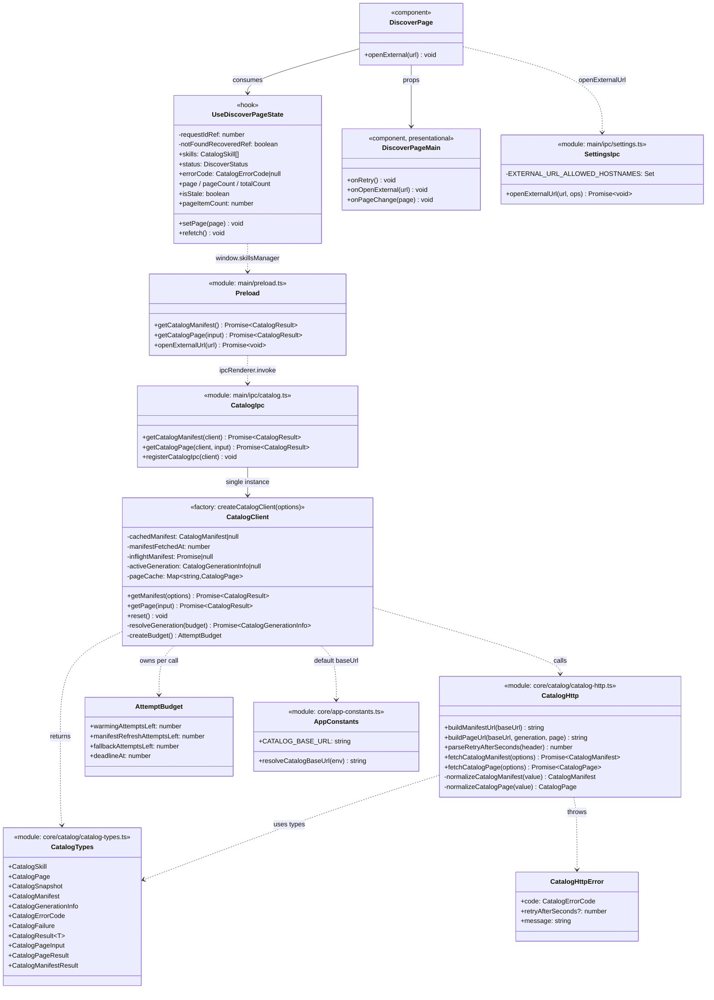
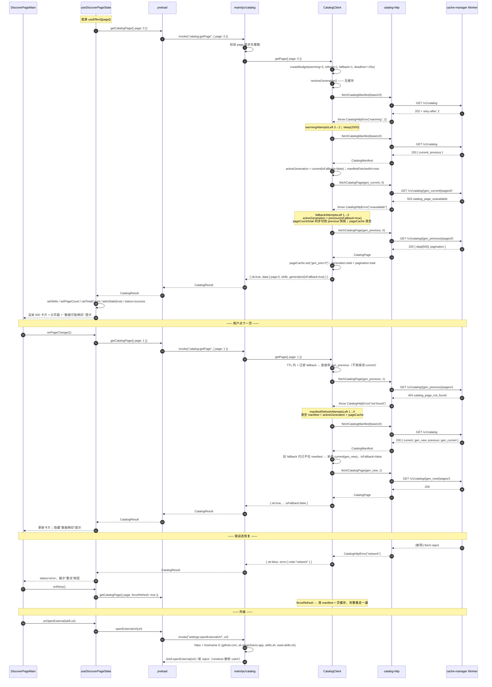
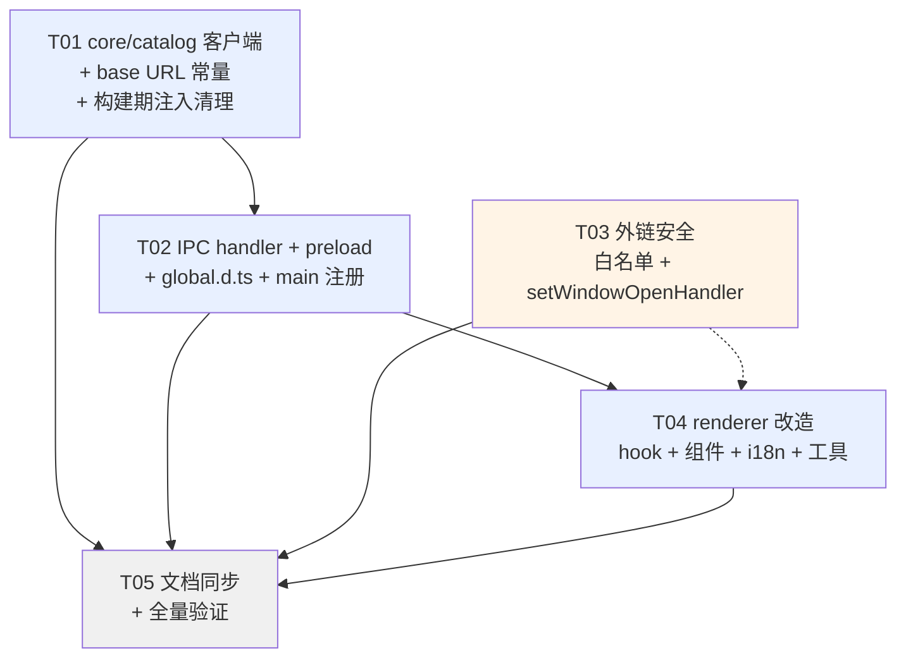

# 发现页数据链路 main 进程归位 —— 实现方案与任务分解

日期：2026-08-04
作者：Architect（Bob）
输入：`.workbuddy/artifacts/2026-08-04-discover-dataflow-review.md`（评审报告）+ 现网代码
输出性质：**纯设计稿**，未修改任何项目文件

---

## 0. TL;DR

把发现页 HTTP 请求从 renderer 搬到 main：新增 `core/catalog/*`（可移植、无 Electron 依赖、单一 `fetchImpl` 注入缝）→ `main/ipc/catalog.ts`（两个 channel，永不 throw，返回判别式 `CatalogResult`）→ `preload` 两个类型化方法 → renderer hook 退化为「调 IPC + 持 UI 状态」。

配套一并解决：Retry-After 生效、404 自愈、generation TTL + 会话锁代、503 回退整体切代、refetch 接线、搜索文案对齐、外链走 main + 白名单、测试、i18n、文档。

**5 个任务**，T01（core）→ T02（IPC/preload）→ T04（renderer），T03（外链安全）可与 T01/T02 并行，T05（文档+全量验证）收尾。

---

## Part A — 系统设计

### 1. 实现思路（Implementation Approach）

#### 1.1 技术难点

| 难点 | 结论 |
|---|---|
| 状态机跨进程后如何保持可测 | 状态机全部下沉 `core/catalog`，**零 Electron / 零 fs 依赖**，只注入 `fetchImpl` / `sleep` / `now` 三个缝，用普通 Vitest 单测覆盖 |
| renderer 无法 abort 一个 `ipcRenderer.invoke` | main 侧用 `AbortSignal.timeout` + 预算 deadline 保证有界返回；renderer 用 **request-id 版本号**丢弃过期响应（项目已有 `isMounted` 同类模式） |
| 202 / 404 / 503 三种重试叠加成死循环 | 引入**三轴独立预算** `AttemptBudget`，每次重入只递减一个计数器且不重置，外加绝对 deadline —— 可证明终止（重入次数 ≤ warming + manifestRefresh + fallback） |
| generation 跨页混用两代（spec 明文禁止） | `activeGeneration` 是**唯一真相源**，503 回退后整体切到 previous 并置 `isFallback`，pageCount/total 同步取自 previous 快照；TTL 刷新时用纯函数 `selectActiveGeneration` 决定是否留在 fallback |
| 跨 tsconfig 类型复用 | 类型单独放 `catalog-types.ts`（零运行时），renderer 的 `global.d.ts` 只 import 它；带 `fetch` 的实现文件 renderer 永不引用。与现有 `core/repositories/repository-api.ts` 完全同构 |
| base URL 不能再走构建期注入 | main 无 dotenv 机制（已核实：全仓只有 `VITE_DEV_SERVER_URL` / `NODE_ENV` 两处 `process.env`），改用**项目已有模式**：`core/app-constants.ts` 常量 + `process.env` 覆盖（与 `RELEASE_MANIFEST_URL` 同构） |

#### 1.2 依据的既有模式（不引入任何新机制 / 新依赖）

| 新代码 | 对标的现有实现 | 证据 |
|---|---|---|
| main 侧 fetch + `fetchImpl` 默认参数注入 | `main/ipc/release.ts:46-49` `getLatestRelease(fetchImpl = fetch, manifestUrl = RELEASE_MANIFEST_URL)` | 一模一样 |
| URL 常量集中管理 | `core/app-constants.ts:13-19` `SKILLS_MANAGER_BASE_URL` / `RELEASE_MANIFEST_URL` | 直接追加 |
| core 内可移植网络客户端 + 自定义 Error 类 | `core/repositories/source-inspection.ts:42-70`（`defaultFetchJson` + `GitHubApiHttpError` + `fetchJson` 注入） | 同构 |
| 结构化错误分类 | `core/repositories/repository-api.ts:62-75` `RepositorySyncFailureCategory` / `RepositorySyncFailure{category,message}` | 沿用 `code + message` 形状 |
| `registerXxxIpc(dep)` + `ipcMain.handle` | `main/ipc/settings.ts:145-179`、`main/index.ts:180-190` | 同构 |
| 纯类型 core 模块给 renderer 复用 | `core/repositories/repository-api.ts` → `renderer/global.d.ts:40-47` | 同构 |
| IPC 单测 mock electron | `main/ipc/settings-external-url.test.ts:7-14` `vi.mock("electron", () => ({ ipcMain: { handle: vi.fn() } }))` | 直接复制 |

**明确不引入**：dotenv、zod、SQLite catalog 表、虚拟列表库、任何新 npm 包。

#### 1.3 分层架构

```
renderer (UI only)
  discover-page.tsx ──► use-discover-page-state.ts ──► window.skillsManager.getCatalogPage
        │                       (UI 状态 / 页内过滤 / 一次性 404 自愈)
        └──► discover-page-main.tsx (纯展示 + onOpenExternal / onRetry 回调)
                            ▲
                       preload.ts  (类型化 invoke，无逻辑)
                            ▲
              main/ipc/catalog.ts  (入参校验 / 永不 throw / 组装 CatalogResult)
                            ▲
        core/catalog/catalog-client.ts  (generation 生命周期 / 三轴预算状态机 / 内存缓存)
                            ▲
        core/catalog/catalog-http.ts    (URL 拼装 / 状态码→错误码 / Retry-After 解析 / 响应形状校验)
                            ▲
                     Node global fetch ──► cache-manager Worker
```

---

### 2. 文件清单

#### 2.1 新增

| 路径 | 一句话职责 |
|---|---|
| `apps/desktop/src/core/catalog/catalog-types.ts` | **零运行时**类型定义：`CatalogSkill` / `CatalogPage` / `CatalogSnapshot` / `CatalogManifest` / `CatalogGenerationInfo` / `CatalogFailure` / `CatalogResult<T>`；renderer 与 preload 唯一可 import 的 catalog 模块 |
| `apps/desktop/src/core/catalog/catalog-http.ts` | 单次 HTTP 往返：拼 URL、发请求、把 202/404/503/其他状态映射成 `CatalogHttpError`、解析并 clamp `Retry-After`、校验响应 JSON 形状并归一化 skill 条目 |
| `apps/desktop/src/core/catalog/catalog-http.test.ts` | 覆盖 URL 拼装、状态码映射、Retry-After 解析边界、脏 JSON 归一化 |
| `apps/desktop/src/core/catalog/catalog-client.ts` | `createCatalogClient()`：generation 解析 + TTL + 会话锁代、202/404/503 三轴预算状态机、manifest single-flight、manifest/page 内存缓存 |
| `apps/desktop/src/core/catalog/catalog-client.test.ts` | 状态机全量单测（见 §8） |
| `apps/desktop/src/main/ipc/catalog.ts` | `catalog:getManifest` / `catalog:getPage` 两个 handler；入参校验；把 client 异常兜成 `CatalogResult`；`registerCatalogIpc(client?)` |
| `apps/desktop/src/main/ipc/catalog.test.ts` | IPC 层单测：入参校验、失败透传、异常兜底、channel 注册 |
| `apps/desktop/src/renderer/features/discover/discover-utils.ts` | 纯 UI 工具：`formatCompact` / `filterSkills`（从 `discover-data.ts` 迁出，去掉全部 HTTP） |
| `apps/desktop/src/renderer/features/discover/discover-utils.test.ts` | 两个纯函数的边界单测 |
| `apps/desktop/src/renderer/features/discover/discover-page.test.tsx` | 发现页集成测试（stub `window.skillsManager`） |

#### 2.2 修改

| 路径 | 改动点 |
|---|---|
| `apps/desktop/src/core/app-constants.ts` | 追加 `CATALOG_BASE_URL` 常量 + `resolveCatalogBaseUrl()`（env 覆盖） |
| `apps/desktop/src/main/preload.ts` | 追加 `getCatalogManifest` / `getCatalogPage` 两个方法 + 类型 import |
| `apps/desktop/src/main/index.ts` | `registerCatalogIpc()` 注册；`createMainWindow` 内调用 `denyExternalWindowOpen(mainWindow)` |
| `apps/desktop/src/main/ipc/settings.ts` | `openExternalUrl` 白名单改为 hostname Set，放行 `skills.sh` / `www.skills.sh` |
| `apps/desktop/src/main/ipc/settings-external-url.test.ts` | 追加 skills.sh 放行 / http 降级拒绝 / 伪装域名拒绝 三条用例 |
| `apps/desktop/src/main/window-menu.ts` | 新增 `denyExternalWindowOpen(target)` 纯函数 |
| `apps/desktop/src/main/window-menu.test.ts` | 追加 setWindowOpenHandler 返回 deny 的用例 |
| `apps/desktop/src/renderer/global.d.ts` | import catalog 类型 + re-export + `Window.skillsManager` 追加两个可选方法 |
| `apps/desktop/src/renderer/features/discover/hooks/use-discover-page-state.ts` | **重写**：去掉全部 fetch/abort/delay/递归重试，改为调 IPC + 消费 `CatalogResult` |
| `apps/desktop/src/renderer/features/discover/discover-page.tsx` | 追加 `onRetry` / `isStale` / `pageItemCount` / `onOpenExternal` 透传 |
| `apps/desktop/src/renderer/features/discover/components/discover-page-main.tsx` | 搜索文案 / 删空转按钮 / 搜索时保留分页器 / error 重试按钮 / 数据稍旧提示 / 外链走回调 / 卡片描述入 i18n |
| `apps/desktop/src/renderer/i18n/resources.ts` | 新增 / 改写 discover 文案（中英双份） |
| `apps/desktop/vite.config.ts` | **回退** `envPrefix: ["VITE_","DISCOVER_"]` 与 `envDir: process.cwd()` 两段（git diff 显示这两段就是为 DISCOVER_ 加的） |
| `apps/desktop/src/renderer/vite-env.d.ts` | **回退**到仅 `/// <reference types="vite/client" />` |
| `docs/superpowers/specs/2026-07-29-skills-sh-catalog-cache-design.md` | 改 Scope 的过时排除项 + 新增 `## Desktop consumer contract` 章节 |
| `AGENTS.md` | 第 13 行「占位」措辞、第 174 行 v1 区域列表补 `Discover` |

#### 2.3 删除

| 路径 | 原因 |
|---|---|
| `apps/desktop/src/renderer/features/discover/discover-data.ts` | HTTP 与类型全部上移 core；纯函数迁至 `discover-utils.ts`。该文件 untracked，改名零 git 历史成本 |
| `apps/desktop/.env.example` | 构建期注入机制被废弃；地址进 `app-constants.ts`。同时提醒本地删除 `.env`（已 gitignore） |

---

### 3. core/catalog 客户端设计

#### 3.1 `catalog-types.ts`（零运行时）

```ts
export type CatalogSkill = {
  id: string;
  slug: string;
  name: string;
  source: string;
  installs: number;
  sourceType: "github" | "well-known";
  installUrl: string | null;
  url: string;
};

export type CatalogPagination = { page: number; perPage: number; total: number; hasMore: boolean };
export type CatalogPage = { data: CatalogSkill[]; pagination: CatalogPagination };

export type CatalogSnapshot = {
  generation: string; generatedAt: string; pageCount: number;
  perPage: number; total: number; view: "all-time";
};
export type CatalogManifest = { schemaVersion: 1; current: CatalogSnapshot; previous?: CatalogSnapshot };

/** renderer 消费的「当前锁定代」信息，pageCount/total 永远与 generation 同源。 */
export type CatalogGenerationInfo = {
  generation: string;
  generatedAt: string;
  pageCount: number;
  total: number;
  /** true = 正在服务 previous 代（503 回退后整次会话锁定），UI 需提示「数据可能稍旧」 */
  isFallback: boolean;
};

export type CatalogErrorCode =
  | "config"           // base URL 未配置 / 非法
  | "warming"          // 202，重试预算耗尽
  | "not-found"        // 404，重取 manifest 后仍不可用 / 入参非法
  | "unavailable"      // 503 且无可用 previous
  | "network"          // 连接失败 / 其它非 2xx
  | "invalid-response" // JSON 形状不合契约
  | "unknown";         // 兜底

export type CatalogFailure = {
  code: CatalogErrorCode;
  message: string;              // 面向日志/诊断的英文技术信息，UI 不直接展示
  retryAfterSeconds?: number;   // 仅 warming
};

export type CatalogResult<T> = { ok: true; data: T } | { ok: false; error: CatalogFailure };

export type CatalogManifestResult = { generation: CatalogGenerationInfo };
export type CatalogPageResult = {
  page: number;
  skills: CatalogSkill[];
  generation: CatalogGenerationInfo;   // 内含权威 pageCount / total / isFallback
};
export type CatalogPageInput = { page: number; forceRefresh?: boolean };
```

> **设计要点**：`CatalogPageResult.generation` 把「这一页属于哪一代 / 这一代共几页 / 全站多少条 / 是否是回退代」一次性带回，renderer 不再需要单独维护 `pageCount`/`totalCount` 的来源判断，B1（跨页混用两代）从类型层面被消灭。

#### 3.2 `catalog-http.ts`

```ts
export class CatalogHttpError extends Error {
  code: CatalogErrorCode;
  retryAfterSeconds?: number;
  constructor(code: CatalogErrorCode, message: string, retryAfterSeconds?: number);
}

export const buildManifestUrl = (baseUrl: string): string;                       // `${base}/v1/catalog`
export const buildPageUrl = (baseUrl: string, generation: string, page: number): string;
//   `${base}/v1/catalog/${encodeURIComponent(generation)}/pages/${page}`

/** "2" → 2；非法/缺失 → 2；clamp 到 [1, 10] 秒。Worker 只发数字形式（app.ts:43-50）。 */
export const parseRetryAfterSeconds = (headerValue: string | null): number;

export const fetchCatalogManifest = (o: HttpOptions): Promise<CatalogManifest>;
export const fetchCatalogPage = (o: HttpOptions & { generation: string; page: number }): Promise<CatalogPage>;

type HttpOptions = { baseUrl: string; fetchImpl: typeof fetch; timeoutMs: number };
```

状态码 → 错误映射（对照 `apps/cache-manager/src/app.ts:200-264`）：

| HTTP | 抛出 | 备注 |
|---|---|---|
| 200 | — | 通过 `normalizeCatalogPage` / `normalizeCatalogManifest` 校验形状 |
| 202 | `CatalogHttpError("warming", …, retryAfterSeconds)` | **main 侧 Node fetch 无 CORS 限制，`retry-after` 头可直接读到 —— P0-2 在此落地** |
| 404 | `CatalogHttpError("not-found", …)` | 仅分页路由会返回；**C3 修复点** |
| 503 | `CatalogHttpError("unavailable", …)` | 仅分页路由会返回 |
| 其它非 2xx | `CatalogHttpError("network", "HTTP {status}")` | |
| fetch reject / timeout | `CatalogHttpError("network", …)` | `AbortSignal.timeout(timeoutMs)` |
| JSON 解析失败 / 形状不符 | `CatalogHttpError("invalid-response", …)` | |

**防御性归一化**（cache-manager 只强校验 `typeof skill.id === "string"`，其余字段原样透传，见 `sync/catalog-client.ts:59`）：
`normalizeCatalogPage` 丢弃 `id` 非字符串的条目，其余字段做 `?? ""` / `?? 0` / `?? null` 兜底，`sourceType` 非法值归一为 `"well-known"`。防止上游脏数据把 renderer 打崩。

#### 3.3 `catalog-client.ts`

```ts
export const CATALOG_GENERATION_TTL_MS = 5 * 60_000;      // 客户端 5min < 服务端 6h
export const CATALOG_MAX_WARMING_ATTEMPTS = 3;            // 首次之外最多 3 次重试
export const CATALOG_MAX_MANIFEST_REFRESH_ATTEMPTS = 1;   // 404 只重取一次 manifest
export const CATALOG_MAX_FALLBACK_ATTEMPTS = 1;           // 503 只回退一次
export const CATALOG_REQUEST_TIMEOUT_MS = 15_000;         // 单次 HTTP
export const CATALOG_CALL_BUDGET_MS = 25_000;             // 单次 IPC 调用总预算
export const CATALOG_MAX_CACHED_PAGES = 6;

export type CatalogClientOptions = {
  baseUrl?: string;              // 默认 resolveCatalogBaseUrl()
  fetchImpl?: typeof fetch;      // 默认全局 fetch
  now?: () => number;            // 默认 Date.now
  sleep?: (ms: number) => Promise<void>;   // 默认 setTimeout Promise
};

export type CatalogClient = {
  getManifest(options?: { forceRefresh?: boolean }): Promise<CatalogResult<CatalogManifestResult>>;
  getPage(input: CatalogPageInput): Promise<CatalogResult<CatalogPageResult>>;
  reset(): void;   // 测试用：清空全部内存状态
};

export const createCatalogClient = (options?: CatalogClientOptions): CatalogClient;

/** 纯函数，单独导出便于单测：决定 TTL 刷新后停留在哪一代。 */
export const selectActiveGeneration = (
  manifest: CatalogManifest,
  previousActive: CatalogGenerationInfo | null
): CatalogGenerationInfo;
```

**闭包内部状态（单例 vs 模块级变量 → 选闭包单例）**

```ts
let cachedManifest: CatalogManifest | null = null;
let manifestFetchedAt = 0;
let inflightManifest: Promise<CatalogManifest> | null = null;   // single-flight，防翻页并发打爆
let activeGeneration: CatalogGenerationInfo | null = null;      // 会话锁定的那一代
const pageCache = new Map<string, CatalogPage>();               // key = `${generation}:${page}`，FIFO 淘汰
```

> **为什么用工厂闭包而不是模块级 `let`**：`main/ipc/catalog.ts` 在 `registerCatalogIpc()` 时创建**唯一一个**实例（等效进程级单例），同时测试可以 `createCatalogClient({ fetchImpl: fake })` 拿到互相隔离的实例，不需要 `vi.resetModules()`。与项目里 `createAppDbRuntime` / `createSkillRepository` 的工厂风格一致。

**三轴预算（终止性保证）**

```ts
type AttemptBudget = {
  warmingAttemptsLeft: number;            // 初值 3
  manifestRefreshAttemptsLeft: number;    // 初值 1
  fallbackAttemptsLeft: number;           // 初值 1
  deadlineAt: number;                     // now() + 25_000
};
```

每个 public 方法入口 **创建一次**预算并向下透传；任何重入路径**只递减一个**计数器且**永不重置**；每次重入前检查 `now() > deadlineAt` 则直接失败。最坏重入次数 = 3 + 1 + 1 = 5，与评审 B2「202 attemptsLeft 不递减、理论无限循环」彻底切割。

**`resolveGeneration(budget)` 精确行为**

1. `baseUrl` 为空/非 `http(s)` → 抛 `CatalogHttpError("config")`（**零网络请求**）。
2. `activeGeneration !== null && now() - manifestFetchedAt < TTL` → 直接返回，不发请求。
3. 否则取 manifest（走 `inflightManifest` single-flight）：
   - 202 → `warmingAttemptsLeft > 0` ? 递减 + `sleep(retryAfter*1000)` + 重入 : 失败 `warming`
   - 成功 → `cachedManifest = m; manifestFetchedAt = now()`
4. `next = selectActiveGeneration(cachedManifest, activeGeneration)`
5. `if (next.generation !== activeGeneration?.generation) pageCache.clear()`
6. `activeGeneration = next`，返回。

**`selectActiveGeneration` 纯函数规则（会话锁代的核心）**

```
if (previousActive?.isFallback && manifest.previous?.generation === previousActive.generation)
    → 停留在 manifest.previous，isFallback 保持 true    // 不因 TTL 刷新而回弹到 current
else
    → manifest.current，isFallback = false              // 含「回退代已被服务端淘汰」的情况
```

> 这条规则同时满足两个要求：**「整次会话锁定一代」**（TTL 刷新不打断回退）与**「回退代消失后自动回归 current」**（避免永久卡在不存在的代上）。

**`getPage(input)` 精确行为**

```
budget = createBudget()
loop:
  gen = resolveGeneration(budget)                       # 可能抛 config / warming / network
  if (!forceRefresh && pageCache.has(`${gen.generation}:${page}`))
      return ok(cached, gen)
  try:
      p = fetchCatalogPage(gen.generation, page)
      pageCache.set(key, p)  (超过 6 页时删最旧)
      gen.total = p.pagination.total                    # A3：page 的 total 覆盖 manifest total
      return ok({ page, skills: p.data, generation: gen })
  catch e:
      case "warming":
          budget.warmingAttemptsLeft-- > 0 ? (sleep(e.retryAfterSeconds*1000); continue) : fail("warming")
      case "not-found":                                  # C3 修复
          budget.manifestRefreshAttemptsLeft-- > 0
              ? (manifestFetchedAt = 0; activeGeneration = null; pageCache.clear(); continue)
              : fail("not-found")
      case "unavailable":                                # B1 修复
          if (budget.fallbackAttemptsLeft-- > 0
              && cachedManifest?.previous
              && cachedManifest.previous.generation !== gen.generation):
                  activeGeneration = toInfo(cachedManifest.previous, isFallback = true)   # 整体切代 + 锁代
                  manifestFetchedAt = now()                                               # 防 TTL 立刻回弹
                  pageCache.clear()
                  continue
          else: fail("unavailable")
      default: fail(e.code)
```

关键收益逐条对齐评审：

| 评审项 | 本设计如何解决 |
|---|---|
| C2 Retry-After | 请求在 Node 侧，`res.headers.get("retry-after")` 真实可读；`parseRetryAfterSeconds` 有独立单测 |
| C3 404 未识别 | `not-found` 分支 → 清 manifest + 清 activeGeneration + 清页缓存 → 重入自动重取 manifest → 用新代重试一次；限次 1，与 warming 预算**互不共享**故不会叠加成环 |
| C4 generation 永不过期 | `manifestFetchedAt` + 5min TTL；挂机超 6h 也会在下次翻页时自动换代 |
| B1 503 回退不完整 | `activeGeneration` **整体**替换为 previous 快照（generation + pageCount + total 一起换），并置 `isFallback: true`；后续翻页直接命中 previous，**不再重复探测 current** |
| B2 202 无上限 | `warmingAttemptsLeft` 递减 + 绝对 deadline |
| B3 无本地缓存 | 本次做**进程内存缓存**（manifest + 最近 6 页 + single-flight）；SQLite 落库明确留作 follow-up |

**内存缓存失效条件汇总**

| 触发 | manifest 缓存 | page 缓存 |
|---|---|---|
| TTL 到期 | 重新拉取 | 仅当 generation 字符串变化才清空 |
| 收到 404 | 立即失效 | 全清 |
| 503 切 previous | 保留（previous 就在里面） | 全清 |
| `forceRefresh: true`（refetch 按钮） | 立即失效 | 全清 |
| 超过 6 页 | — | FIFO 淘汰最早插入项 |
| 进程退出 | 全丢（v1 不落盘） | 全丢 |

---

### 4. IPC 层设计（`main/ipc/catalog.ts`）

```ts
import { ipcMain } from "electron";
import { createCatalogClient, type CatalogClient } from "../../core/catalog/catalog-client.js";
import type {
  CatalogManifestResult, CatalogPageInput, CatalogPageResult, CatalogResult
} from "../../core/catalog/catalog-types.js";

export type { CatalogManifestResult, CatalogPageInput, CatalogPageResult, CatalogResult };

export const getCatalogManifest = (
  client: CatalogClient
): Promise<CatalogResult<CatalogManifestResult>>;

export const getCatalogPage = (
  client: CatalogClient,
  input: unknown                              // 来自 renderer，一律当不可信
): Promise<CatalogResult<CatalogPageResult>>;

export const registerCatalogIpc = (client: CatalogClient = createCatalogClient()): void;
```

| Channel | 入参 | 出参 |
|---|---|---|
| `catalog:getManifest` | 无 | `CatalogResult<CatalogManifestResult>` |
| `catalog:getPage` | `CatalogPageInput` = `{ page: number; forceRefresh?: boolean }` | `CatalogResult<CatalogPageResult>` |

**硬约束**

1. **两个 handler 永不 reject**。`ipcRenderer.invoke` 的 rejection 会被 Electron 包成 `Error invoking remote method 'x': Error: y`，错误类型信息全部丢失 —— 所以统一用判别式返回值。项目已有同类先例：`repositories.ts` 的 sync 结果内嵌 `error: { category, message }`。
2. **入参校验在 main**：`Number.isInteger(page) && page >= 0` 不成立（含 `-1` / `1.5` / `"0"` / `undefined`）→ 直接返回 `{ ok:false, error:{ code:"not-found", message:"Invalid catalog page index." } }`，**不调用 client、不发网络请求**。语义与 Worker 自身对非法 page 返回 404 一致（`app.ts:235-240`）。
3. **兜底 try/catch**：client 抛出的任何未预期异常 → `{ ok:false, error:{ code:"unknown", message } }`，并 `console.error` 记录（与 `main/index.ts` 现有错误日志风格一致）。
4. `registerCatalogIpc()` 在 `main/index.ts` 的注册序列中按字母序插入 `registerAppInfoIpc()` 之后：

```ts
registerAppInfoIpc();
registerCatalogIpc();          // ← 新增
registerDistributionIpc(dbRuntime.getDb);
```

> 不需要 `dbRuntime`：v1 不落库，client 无 DB 依赖。未来加 SQLite 缓存时再改成 `registerCatalogIpc(dbRuntime.getDb)`，签名向后兼容。

**错误码 → renderer 语义对照表**

| code | 含义 | UI 处理 |
|---|---|---|
| `config` | base URL 未配置/非法 | 展示配置错误文案 + 重试按钮（重试大概率仍失败，但保持一致） |
| `warming` | 服务端正在构建首个 generation | 展示「目录正在准备中，请稍后重试」+ 重试按钮 |
| `not-found` | 代已轮换且重取后仍不可用 / page 越界 | hook 自动重置 page=0 并重试**一次**；再失败才进 error 态 |
| `unavailable` | KV 未传播且无 previous 可回退 | 展示通用错误 + 重试按钮 |
| `network` | 断网 / 超时 / 5xx | 展示网络错误 + 重试按钮 |
| `invalid-response` / `unknown` | 契约异常 | 展示通用错误 + 重试按钮 |

---

### 5. preload + 全局类型

#### 5.1 `main/preload.ts`

追加类型 import：

```ts
import type {
  CatalogManifestResult, CatalogPageInput, CatalogPageResult, CatalogResult
} from "../core/catalog/catalog-types";
```

在 `contextBridge.exposeInMainWorld("skillsManager", { ... })` 内按字母序插入（`getAppSettings` 之后、`getHealth` 之前）：

```ts
getCatalogManifest: () =>
  ipcRenderer.invoke("catalog:getManifest") as Promise<CatalogResult<CatalogManifestResult>>,
getCatalogPage: (input: CatalogPageInput) =>
  ipcRenderer.invoke("catalog:getPage", input) as Promise<CatalogResult<CatalogPageResult>>,
```

> preload **不含任何逻辑**，纯 invoke 转发 + `as` 类型标注 —— 与现有 22 个方法完全同风格（`preload.ts:50-142`）。

#### 5.2 全局类型声明文件位置

**已定位：`apps/desktop/src/renderer/global.d.ts`**（全仓唯一 `interface Window`，见 `global.d.ts:89-149`）。三处改动：

1. 顶部 import（第 47 行 `source-inspection` import 之后）：
```ts
import type {
  CatalogGenerationInfo as CoreCatalogGenerationInfo,
  CatalogManifestResult as CoreCatalogManifestResult,
  CatalogPageInput as CoreCatalogPageInput,
  CatalogPageResult as CoreCatalogPageResult,
  CatalogResult as CoreCatalogResult,
  CatalogSkill as CoreCatalogSkill,
  CatalogFailure as CoreCatalogFailure,
  CatalogErrorCode as CoreCatalogErrorCode
} from "../core/catalog/catalog-types";
```

2. re-export（第 87 行 `SupportedLocale` 附近）：
```ts
export type CatalogSkill = CoreCatalogSkill;
export type CatalogGenerationInfo = CoreCatalogGenerationInfo;
export type CatalogFailure = CoreCatalogFailure;
export type CatalogErrorCode = CoreCatalogErrorCode;
export type CatalogManifestResult = CoreCatalogManifestResult;
export type CatalogPageInput = CoreCatalogPageInput;
export type CatalogPageResult = CoreCatalogPageResult;
export type CatalogResult<T> = CoreCatalogResult<T>;
```

3. `Window.skillsManager` 内追加（保持既有 `?:` 可选风格，测试可只 stub 需要的方法）：
```ts
getCatalogManifest?: () => Promise<CatalogResult<CatalogManifestResult>>;
getCatalogPage?: (input: CatalogPageInput) => Promise<CatalogResult<CatalogPageResult>>;
```

> **跨 tsconfig 校验注意**：`tsconfig.renderer.json` 的 `include` 只有 `src/renderer/**`，但 `global.d.ts` 引用的 `core/*` 文件会被拉进 program 一并类型检查（现状 `repository-api.ts` 已如此）。因此 `catalog-types.ts` 必须**零运行时、零 Node 专属 API**；带 `fetch` 的 `catalog-http.ts` / `catalog-client.ts` renderer 侧**任何文件都不得 import**。这是 §2 把类型单独拆文件的根本原因。
>
> 另：`tsconfig.main.json` 为 `module: NodeNext`，但 `apps/desktop/package.json` 无 `"type": "module"`，故按 CJS 解析，相对 import **带不带 `.js` 后缀都能过**（现网 `settings.ts` 带、`release.ts` 不带）。建议 core/main 新文件统一带 `.js` 后缀，与同目录多数文件一致。

---

### 6. renderer 改造

#### 6.1 `discover-data.ts` → 删除，逻辑一分为二

| 原内容 | 去向 |
|---|---|
| `CatalogSkill` / `CatalogPage` / `CatalogSnapshot` / `CatalogManifest` 类型 | → `core/catalog/catalog-types.ts`，renderer 从 `@/global` 引用 |
| `CATALOG_BASE_URL`（`import.meta.env`） | → **删除**，改由 main 侧 `resolveCatalogBaseUrl()` |
| `fetchCatalogManifest` / `fetchCatalogPage` | → `core/catalog/catalog-http.ts` |
| `CatalogWarmingError` / `CatalogUnavailableError` | → 由 `CatalogFailure.code` 判别式取代 |
| `formatCompact` / `filterSkills` | → `discover-utils.ts`（纯函数，新增单测） |

#### 6.2 `use-discover-page-state.ts` —— 重写后只剩三件事

**调 IPC、消费干净数据、持有 UI 状态。** 目标：从 195 行降到 ~110 行，删掉 `delay` / `AbortController` / `loadCycleRef` / 递归 `loadPageWithFallback` / 两处 `console.log`。

```ts
type DiscoverStatus = "loading" | "success" | "error";

export function useDiscoverPageState() {
  const [skills, setSkills] = useState<CatalogSkill[]>([]);
  const [status, setStatus] = useState<DiscoverStatus>("loading");
  const [errorCode, setErrorCode] = useState<CatalogErrorCode | null>(null);
  const [searchQuery, setSearchQuery] = useState("");
  const [page, setPage] = useState(0);
  const [pageCount, setPageCount] = useState(0);
  const [totalCount, setTotalCount] = useState(0);
  const [isStale, setIsStale] = useState(false);     // = generation.isFallback

  const requestIdRef = useRef(0);                    // 竞态守卫，替代 AbortController
  const notFoundRecoveredRef = useRef(false);        // 404 自愈只做一次

  const load = useCallback(async (targetPage: number, forceRefresh = false) => {
    const requestId = ++requestIdRef.current;
    setStatus("loading");
    setErrorCode(null);

    const api = window.skillsManager?.getCatalogPage;
    if (!api) { setStatus("error"); setErrorCode("unknown"); return; }

    const result = await api({ page: targetPage, forceRefresh });
    if (requestId !== requestIdRef.current) return;          // 过期响应直接丢弃

    if (result.ok) {
      setSkills(result.data.skills);
      setPageCount(result.data.generation.pageCount);
      setTotalCount(result.data.generation.total);
      setIsStale(result.data.generation.isFallback);
      notFoundRecoveredRef.current = false;                  // 成功后重置自愈额度
      setStatus("success");
      return;
    }

    // 404 自愈：代已轮换 / page 越界 → 回到第 0 页重试一次
    if (result.error.code === "not-found" && !notFoundRecoveredRef.current) {
      notFoundRecoveredRef.current = true;
      if (targetPage !== 0) { setPage(0); return; }          // setPage 触发 effect 重载
      void load(0, true);
      return;
    }

    setErrorCode(result.error.code);
    setStatus("error");
  }, []);

  useEffect(() => { void load(page); }, [page, load]);

  const filteredSkills = useMemo(() => filterSkills(skills, searchQuery), [skills, searchQuery]);
  const formattedTotal = useMemo(() => formatCompact(totalCount), [totalCount]);
  const refetch = useCallback(() => { notFoundRecoveredRef.current = false; void load(page, true); }, [load, page]);

  return {
    skills: filteredSkills,
    pageItemCount: skills.length,        // 未过滤的当前页条数 → 搜索框文案
    status, errorCode, searchQuery, setSearchQuery,
    totalCount, formattedTotal, isStale,
    page, pageCount, setPage, refetch
  };
}
```

要点：
- **无 fetch、无 AbortController、无 setTimeout、无递归**，重试/退避/回退全部在 main。
- `notFoundRecoveredRef` 与 main 侧的 `manifestRefreshAttemptsLeft` **是两层独立限次**，两者都不可能自增，组合仍然有界。
- 删除 `MAX_FALLBACK_ATTEMPTS` 常量（语义已上移 core）。
- 删除 `console.log`（评审 B6）。

#### 6.3 `discover-page.tsx`

```tsx
const openExternal = useCallback((url: string) => {
  void window.skillsManager?.openExternalUrl?.(url).catch(() => {
    /* 白名单拒绝或系统失败：静默忽略，不打断浏览 */
  });
}, []);

<DiscoverPageMain
  skills={state.skills}
  status={state.status}
  errorCode={state.errorCode}
  searchQuery={state.searchQuery}
  onSearchChange={state.setSearchQuery}
  pageItemCount={state.pageItemCount}
  isStale={state.isStale}
  page={state.page}
  pageCount={state.pageCount}
  onPageChange={state.setPage}
  onRetry={state.refetch}          // ← C5 修复：refetch 终于接上了
  onOpenExternal={openExternal}    // ← C7 修复
/>
```

> `openExternalUrl` 必须 `.catch()`：`skill.url` 是上游 skills.sh 透传的**不可信数据**，可能命中白名单拒绝而 reject，未捕获会产生 unhandled rejection。

#### 6.4 `discover-page-main.tsx` 具体改动点

| # | 位置 | 改动 |
|---|---|---|
| 1 | `:73-80` 搜索框 | `placeholder` → `t("discover.searchPlaceholderPage", { count: pageItemCount })`（「在当前页 {{count}} 条中筛选」）。移除 `formattedTotal` prop 依赖 |
| 2 | `:82-90` 搜索按钮 | **整块删除**（无 onClick 的空壳）。同时移除 `ArrowRight` import。输入框已即时过滤，不需要提交按钮 |
| 3 | `:43` `isSearching` | 删除该变量 |
| 4 | `:120` 分页器条件 | `!isSearching && pageCount > 1` → `pageCount > 1`（**搜索时保留分页器**，C6 修复） |
| 5 | `:101-106` error 区块 | 文案改用 `errorCode` 映射的 i18n key；下方加 `<Button variant="outline" onClick={onRetry}>{t("discover.retry")}</Button>` |
| 6 | 新增 | `isStale` 为真时，在分隔线下方渲染一条轻量提示：`<p className="text-xs text-muted-foreground text-center">{t("discover.staleNotice")}</p>` |
| 7 | `:186-190` 卡片描述 | 硬编码英文 → `t("discover.card.githubDescription", { source })` / `t("discover.card.wellKnownDescription", { source })`（B5 修复） |
| 8 | `:199-209` 外链 | `<a href target="_blank">` → `<button type="button" onClick={() => onOpenExternal(skill.url)}>`，className 沿用原样式 + `cursor-pointer`。`SkillCard` 增加 `onOpenExternal` prop |
| 9 | props 类型 | 移除 `error: string` / `formattedTotal`；新增 `errorCode: CatalogErrorCode \| null`、`pageItemCount: number`、`isStale: boolean`、`onRetry: () => void`、`onOpenExternal: (url: string) => void` |
| 10 | `:13-14` import | `import type { CatalogSkill } from "../discover-data"` → `from "@/global"`；`import { formatCompact } from "../discover-data"` → `from "../discover-utils"`。**`formatCompact` 在 `SkillCard:168` 仍在用（渲染 installs），不要一起删掉** |

> 命名提示：`discover-utils.ts` 的 `filterSkills` 与 `features/skills/components/skills-page-data.ts:127` 的 `filterSkills` 同名但**签名与语义完全不同**（后者接对象参数、做多维筛选）。两者不在同一模块、无冲突，不要误合并。

**error 文案映射**（组件内小函数或 i18n 动态 key）：

```ts
const errorMessageKey = (code: CatalogErrorCode | null): string => {
  switch (code) {
    case "config":  return "discover.errors.config";
    case "warming": return "discover.errors.warming";
    default:        return "discover.error";      // 复用既有通用文案
  }
};
```

#### 6.5 i18n 新增/修改（`renderer/i18n/resources.ts`，中英各一份）

| key | 中文 | English | 说明 |
|---|---|---|---|
| `discover.searchPlaceholderPage` | `在当前页 {{count}} 条中筛选` | `Filter within {{count}} skills on this page` | **新增**，取代误导性的全量搜索暗示 |
| `discover.searchPlaceholder` | — | — | **删除**（连同 `searchButton`），确认无其它引用 |
| `discover.searchButton` | — | — | **删除**（按钮已移除；`Input` 的 `aria-label` 改用 `discover.searchAriaLabel`） |
| `discover.searchAriaLabel` | `筛选当前页技能` | `Filter skills on this page` | 新增 |
| `discover.retry` | `重试` | `Retry` | 新增 |
| `discover.staleNotice` | `当前展示的是上一版目录数据，可能稍旧。` | `Showing the previous catalog snapshot; data may be slightly out of date.` | 新增 |
| `discover.errors.config` | `技能目录服务地址未配置，请联系维护者。` | `The catalog service URL is not configured.` | 新增 |
| `discover.errors.warming` | `技能目录正在准备中，请稍后重试。` | `The catalog is being prepared. Please retry shortly.` | 新增 |
| `discover.card.githubDescription` | `来自 {{source}} 的 GitHub 技能。安装后即可为 Agent 增加该能力。` | `GitHub skill from {{source}}. Install to add this capability to your agent.` | 新增（原硬编码英文入 i18n） |
| `discover.card.wellKnownDescription` | `来自 {{source}} 的 Well-known 技能。` | `Well-known skill from {{source}}.` | 新增 |

保留不动：`heading` / `description` / `empty` / `error` / `loading` / `installs` / `sourceType.*` / `card.openDetail` / `card.viewSource` / `pagination.pageInfo`。

---

### 7. base URL 配置方案

#### 7.1 现状调研结论（以代码为准）

- 全仓 main/core 只有 **3 处** `process.env`：`target-scanner.ts:46`（PATH）、`index.ts:35`（`VITE_DEV_SERVER_URL`）、`repositories.ts:721`（`NODE_ENV` / `VITE_DEV_SERVER_URL`）。
- **main 进程没有任何 dotenv 加载机制**，`.env` 只被 Vite 在构建期读取。
- 现有对外 URL 的唯一模式：`core/app-constants.ts:13-19` 硬编码常量（`SKILLS_MANAGER_BASE_URL` / `RELEASE_MANIFEST_URL` / `GITHUB_TOKEN_HELP_URL`），`release.ts:48` 以默认参数形式消费。

#### 7.2 方案（严格匹配既有模式，不引入新机制）

在 `core/app-constants.ts` 末尾追加：

```ts
/**
 * cache-manager catalog API base URL.
 * 开发/自建部署可用 SKILLS_MANAGER_CATALOG_BASE_URL 覆盖（与 VITE_DEV_SERVER_URL 同样通过
 * cross-env 在 dev 脚本注入）；打包产物使用此常量。
 */
export const CATALOG_BASE_URL = "https://skills-manager-cache-manager.mockplus.workers.dev";

export const resolveCatalogBaseUrl = (
  env: NodeJS.ProcessEnv = process.env
): string => (env.SKILLS_MANAGER_CATALOG_BASE_URL ?? CATALOG_BASE_URL).trim().replace(/\/+$/, "");
```

- 尾部斜杠归一，避免 `//v1/catalog`。
- `resolveCatalogBaseUrl` 是纯函数（env 可注入）→ 单测直接覆盖「未配置」分支。
- `createCatalogClient()` 默认 `baseUrl = resolveCatalogBaseUrl()`。

#### 7.3 未配置 / 非法时的错误态

`catalog-client` 在**发任何请求之前**校验：

```ts
if (!baseUrl || !/^https?:\/\//.test(baseUrl)) throw new CatalogHttpError("config", "Catalog base URL is not configured.");
```

→ IPC 返回 `{ ok:false, error:{ code:"config" } }` → hook 置 `errorCode="config"` → UI 显示 `discover.errors.config` +「重试」按钮。**零网络请求**，可被单测精确断言（`expect(fetchImpl).not.toHaveBeenCalled()`）。

> 常量非空时该分支生产环境不会触发，但对 fork / 自建 / 误传空 env 的场景仍然必要，且是评审 P2 点名要覆盖的测试用例。

#### 7.4 一并清理

- 删除 `apps/desktop/.env.example`；提示开发者删除本地 `.env`（已 gitignore，不入库）。
- `vite.config.ts` 回退 `envPrefix` / `envDir` 两段（git diff 确认这两段就是为 `DISCOVER_` 新增的）。
- `vite-env.d.ts` 回退为单行 `/// <reference types="vite/client" />`。
- ⚠️ **需 team-lead 确认**：`skills-manager-cache-manager.mockplus.workers.dev` 是否为长期正式地址。建议后续收敛到 `sk.magicfuture.app` 子路径/子域，与 `RELEASE_MANIFEST_URL` 同源治理（本次不做，列为 follow-up）。

---

### 8. 外链安全（C7）

#### 8.1 `main/ipc/settings.ts` 最小改动

现状 `openExternalUrl`（`:128-143`）是三个布尔条件的硬编码判断。改为 hostname Set，**保持原错误信息不变**以免打断既有测试：

```ts
const EXTERNAL_URL_ALLOWED_HOSTNAMES = new Set([
  "github.com",
  "sk.magicfuture.app",
  "skills.sh",
  "www.skills.sh"
]);

export const openExternalUrl = async (
  url: string,
  operations: OpenExternalOperations = shell
): Promise<void> => {
  const parsedUrl = new URL(url);
  const isAllowedHost =
    parsedUrl.protocol === "https:" && EXTERNAL_URL_ALLOWED_HOSTNAMES.has(parsedUrl.hostname);
  const isGitHubTokenHelpUrl = parsedUrl.href === GITHUB_TOKEN_HELP_URL;

  if (!isAllowedHost && !isGitHubTokenHelpUrl) {
    throw new Error("Only approved settings URLs can be opened.");
  }
  await operations.openExternal(url);
};
```

- Set 精确匹配 → `https://skills.sh.evil.com` 自然被拒。
- 强制 `https:` → `http://skills.sh` 被拒。
- 决策：**不拆独立 catalog 白名单**。当前只多两个 hostname，拆两套白名单会带来两条 IPC 通道和两份类型，收益为负。若未来 catalog 外链域名膨胀再拆。

> `skill.url` 的实际 host：cache-manager 对上游字段**全量透传**、只强校验 `id`（`sync/catalog-client.ts:59`），因此 host 取决于 skills.sh。`sourceType === "github"` 的多为 `github.com`（已放行），`well-known` 的多为 `skills.sh`。**首个任务执行时请实测一页数据确认 host 分布**，若出现第三方 host，则渲染层对不在白名单内的 URL 不显示外链入口（而不是放宽白名单）。

#### 8.2 主窗口兜底 deny

`main/window-menu.ts` 新增纯函数（结构化类型，便于单测，与该文件 `disableWindowMenuBar` 同风格）：

```ts
type WindowOpenHandlerTarget = {
  webContents: { setWindowOpenHandler: (handler: () => { action: "deny" }) => void };
};

/** 拒绝渲染进程发起的一切新窗口；外链必须显式走 settings:openExternalUrl 白名单。 */
export const denyExternalWindowOpen = (target: WindowOpenHandlerTarget): void => {
  target.webContents.setWindowOpenHandler(() => ({ action: "deny" }));
};
```

`main/index.ts` 的 `createMainWindow` 内、`disableWindowMenuBar(mainWindow)` 之后调用一次。

> `will-navigate` 拦截（防 `target="_self"` 把应用导航走）价值相近但需要区分 dev server URL，误伤风险高 → **列为 follow-up，本次不做**。

---

## Part B — 任务分解

### 9. 依赖包

**无新增依赖。** 全部使用现有能力：

```
- Node 全局 fetch / AbortSignal.timeout：Electron 41.7.1 内置 Node 22，无需 polyfill
- vitest ^4.1.7：既有测试框架（jsdom 环境，core/main 单测同样在此环境跑，现网 release/settings 单测已验证可行）
- @testing-library/react ^16.3.2：renderer 组件测试
- react-i18next ^17.0.8：既有 i18n
```

### 10. 任务列表（按依赖顺序）

---

#### **T01 — core/catalog 客户端 + base URL 常量 + 构建期注入清理**
**优先级** P0 ｜ **依赖** 无 ｜ **可并行** 与 T03 并行

**涉及文件**
- 新增 `apps/desktop/src/core/catalog/catalog-types.ts`
- 新增 `apps/desktop/src/core/catalog/catalog-http.ts`
- 新增 `apps/desktop/src/core/catalog/catalog-http.test.ts`
- 新增 `apps/desktop/src/core/catalog/catalog-client.ts`
- 新增 `apps/desktop/src/core/catalog/catalog-client.test.ts`
- 修改 `apps/desktop/src/core/app-constants.ts`
- 修改 `apps/desktop/vite.config.ts`（回退 envPrefix/envDir）
- 修改 `apps/desktop/src/renderer/vite-env.d.ts`（回退）
- 删除 `apps/desktop/.env.example`

**验收要点**
1. `catalog-types.ts` 内 **0 个 import、0 行运行时代码**（`grep -c "^import" = 0`）。
2. `catalog-client.ts` / `catalog-http.ts` **不 import 任何 electron / node:fs / node:path**。
3. 单测覆盖 §11 列出的 core 全部用例，**全绿**。
4. 死循环防护有断言：混合 202→404→503 场景下 `fetchImpl` 调用次数 ≤ 8。
5. `pnpm run build:main` 通过（PowerShell 执行）。
6. `grep -rn "DISCOVER_CATALOG_BASE_URL" apps/desktop` 只剩 0 命中（含 vite.config、vite-env.d.ts、.env.example 全部清理）。

---

#### **T02 — IPC handler + preload + 全局类型 + main 注册**
**优先级** P0 ｜ **依赖** T01

**涉及文件**
- 新增 `apps/desktop/src/main/ipc/catalog.ts`
- 新增 `apps/desktop/src/main/ipc/catalog.test.ts`
- 修改 `apps/desktop/src/main/preload.ts`
- 修改 `apps/desktop/src/main/index.ts`（`registerCatalogIpc()`）
- 修改 `apps/desktop/src/renderer/global.d.ts`

**验收要点**
1. 两个 handler 在任何输入下**都不 reject**（单测用 throw 版 client stub 断言）。
2. 非法 `page`（`-1` / `1.5` / `"0"` / `undefined` / `null`）→ `not-found` 失败且 client **零调用**。
3. `registerCatalogIpc` 恰好注册 `catalog:getManifest` + `catalog:getPage` 两个 channel（mock `ipcMain.handle` 断言调用参数）。
4. `pnpm run check` 通过（main + renderer 双 tsconfig，验证 `global.d.ts` 跨层类型链路成立）。
5. `pnpm run build:main` 通过。

---

#### **T03 — 外链安全：白名单 + setWindowOpenHandler**
**优先级** P1 ｜ **依赖** 无（可与 T01/T02 并行）

**涉及文件**
- 修改 `apps/desktop/src/main/ipc/settings.ts`
- 修改 `apps/desktop/src/main/ipc/settings-external-url.test.ts`
- 修改 `apps/desktop/src/main/window-menu.ts`
- 修改 `apps/desktop/src/main/window-menu.test.ts`
- 修改 `apps/desktop/src/main/index.ts`（调用 `denyExternalWindowOpen`）

**验收要点**
1. `settings-external-url.test.ts` 原有 5 条用例**全部保持通过**（错误信息未变）。
2. 新增用例：`https://skills.sh/x` 放行；`http://skills.sh` 拒绝；`https://skills.sh.evil.com` 拒绝。
3. `window-menu.test.ts` 断言 handler 返回 `{ action: "deny" }`。
4. `pnpm run build:main` + `pnpm test` 通过。

> T02 与 T03 都改 `main/index.ts`，注意合并顺序，避免冲突（一个加 `registerCatalogIpc()`，一个加 `denyExternalWindowOpen(mainWindow)`，位置不同，冲突面很小）。

---

#### **T04 — renderer 改造：hook + 组件 + 工具 + i18n**
**优先级** P0 ｜ **依赖** T02（需要 `window.skillsManager.getCatalogPage` 类型）、T03（外链方法语义）

**涉及文件**
- 新增 `apps/desktop/src/renderer/features/discover/discover-utils.ts`
- 新增 `apps/desktop/src/renderer/features/discover/discover-utils.test.ts`
- 新增 `apps/desktop/src/renderer/features/discover/discover-page.test.tsx`
- 删除 `apps/desktop/src/renderer/features/discover/discover-data.ts`
- 修改 `apps/desktop/src/renderer/features/discover/hooks/use-discover-page-state.ts`（重写）
- 修改 `apps/desktop/src/renderer/features/discover/discover-page.tsx`
- 修改 `apps/desktop/src/renderer/features/discover/components/discover-page-main.tsx`
- 修改 `apps/desktop/src/renderer/i18n/resources.ts`

**验收要点**
1. `grep -rn "fetch(" apps/desktop/src/renderer/features/discover` → **0 命中**。
2. `grep -rn "console.log" apps/desktop/src/renderer/features/discover` → **0 命中**。
3. `grep -rn "target=\"_blank\"" apps/desktop/src/renderer/features/discover` → **0 命中**。
4. `grep -rn "import.meta.env" apps/desktop/src/renderer/features/discover` → **0 命中**。
5. 搜索时分页器仍然渲染；搜索框 placeholder 显示当前页条数；空转搜索按钮已删除。
6. error 态出现「重试」按钮且点击后能恢复到 success（测试断言两次 IPC 调用）。
7. 卡片描述与全部新文案走 `t()`，中英资源都补齐（无 `missingKey` 警告）。
8. `pnpm run check` + `pnpm test` 通过。

---

#### **T05 — 文档同步 + 全量验证**
**优先级** P1 ｜ **依赖** T01 / T02 / T03 / T04

**涉及文件**
- 修改 `docs/superpowers/specs/2026-07-29-skills-sh-catalog-cache-design.md`
- 修改 `AGENTS.md`
- （验证）`pnpm run check`、`pnpm run build:main`、`pnpm test`

**验收要点**
1. spec 的 `## Scope` 中「第一版不包含：… Electron renderer 或 main process 接入」一行改为反映现状（main process 已接入、renderer 直连明确禁止）。
2. spec 新增 `## Desktop consumer contract` 章节（插在 `## Failure Rules` 与 `## Free Tier Budget` 之间），内容见 §12。
3. `AGENTS.md:13`「Cloudflare Hono cache manager 占位」→ 去掉「占位」，说明已提供 catalog 缓存 API。
4. `AGENTS.md:174` v1 区域列表补 `Discover`（当前为 `Sources`、`Repositories`、`Skills`、`Targets`、`Settings`）。
5. 三条命令全绿（PowerShell 执行 pnpm）。

---

### 11. 测试清单

| 测试文件 | 覆盖内容 |
|---|---|
| `core/catalog/catalog-http.test.ts` | ① `buildPageUrl` 对 generation 做 `encodeURIComponent`；② base URL 尾斜杠归一；③ `parseRetryAfterSeconds`：`"2"`→2、`"0"`→1（clamp 下界）、`"999"`→10（clamp 上界）、`null`→2、`"abc"`→2；④ 202/404/503/500 → 对应 `code`；⑤ 200 但 JSON 非法 → `invalid-response`；⑥ `data` 内 `id` 非字符串的条目被丢弃、缺失字段被兜底 |
| `core/catalog/catalog-client.test.ts` | ① happy path：manifest→page 0，`pagination.total` **覆盖** manifest total；② **202 重试成功**（断言 `sleep` 收到 `retryAfter*1000`，验证 Retry-After 真正生效）；③ 202 超预算 → `warming` 且 fetch 次数 = 4；④ **503 → 回退 previous**，返回 `isFallback:true` 且 pageCount/total 来自 previous 快照；⑤ 回退后**第二次翻页直接打 previous**（断言 current 的 URL 不再出现）；⑥ 503 且无 previous → `unavailable`；⑦ **404 → 重取 manifest → 用新代重试成功**；⑧ 404 连续两次 → `not-found` 且总 fetch 次数有界；⑨ TTL 内不重取 manifest / TTL 外重取（注入 `now`）；⑩ TTL 刷新时仍停留在 fallback 代（`selectActiveGeneration` 纯函数单测）；⑪ 回退代已被服务端淘汰 → 自动回到 current；⑫ page 缓存命中不重复请求；⑬ `forceRefresh` 绕过缓存；⑭ 缓存超过 6 页 FIFO 淘汰；⑮ **base URL 为空 → `config` 且 fetch 零调用**；⑯ fetch reject → `network`；⑰ manifest single-flight：并发两次 `getPage` 只发一次 manifest 请求；⑱ **混合 202/404/503 不死循环**（fetch 次数上界断言） |
| `main/ipc/catalog.test.ts` | ① client 成功 → `{ ok:true }` 透传；② client 返回失败 → 原样透传 `code`；③ client throw → `{ ok:false, code:"unknown" }`，不 reject；④ 非法 page 五种输入 → `not-found` 且 client 零调用；⑤ `registerCatalogIpc` 注册两个 channel（`vi.mock("electron")`） |
| `main/ipc/settings-external-url.test.ts`（扩展） | ① `https://skills.sh/skills/x` 放行；② `http://skills.sh` 拒绝；③ `https://skills.sh.evil.com` 拒绝；④ 原 5 条用例回归 |
| `main/window-menu.test.ts`（扩展） | `denyExternalWindowOpen` 注册 handler 且返回 `{action:"deny"}` |
| `renderer/features/discover/discover-utils.test.ts` | `formatCompact`：999 / 1000 / 999999 / 1000000 边界；`filterSkills`：name/source/id 命中、大小写不敏感、空查询原样返回、纯空格查询原样返回 |
| `renderer/features/discover/discover-page.test.tsx` | ① stub `getCatalogPage` 成功 → 渲染卡片 + 分页信息；② **搜索时分页器仍在 DOM**；③ placeholder 含当前页条数；④ `errorCode:"network"` → 渲染「重试」按钮，点击后第二次调用成功 → 卡片出现（**refetch 接线验证**）；⑤ `not-found` 失败 → 自动重试一次并恢复，且**不会无限调用**（断言调用次数 ≤ 2）；⑥ `isFallback:true` → 渲染「数据可能稍旧」提示；⑦ `code:"warming"` → 渲染 warming 文案；⑧ `code:"config"` → 渲染配置错误文案；⑨ 点击卡片详情 → `openExternalUrl` 收到 `skill.url`，且 DOM 内无 `target="_blank"`；⑩ `window.skillsManager` 缺失时不崩溃 |

**测试执行命令（PowerShell，Git Bash 下 pnpm shim 有坑）**
```powershell
pnpm --filter @skills-manager/desktop test
pnpm --filter @skills-manager/desktop run check
pnpm --filter @skills-manager/desktop run build:main
```

---

### 12. 需更新的文档

#### 12.1 `docs/superpowers/specs/2026-07-29-skills-sh-catalog-cache-design.md`

**(a) 修改 `## Scope` 第一版不包含列表**：删除/改写「Electron renderer 或 main process 接入」一行为：

> - Electron renderer 直连 Worker（发现页一律经由 main process 消费，见 Desktop consumer contract）。

**(b) 新增章节（插在 `## Failure Rules` 之后、`## Free Tier Budget` 之前）**：

```markdown
## Desktop consumer contract

桌面端只允许 Electron main process 访问本 Worker，renderer 不得直接发起 HTTP 请求。

- 客户端实现：`apps/desktop/src/core/catalog/*`（可移植、无 Electron 依赖）
- IPC 通道：`catalog:getManifest`、`catalog:getPage`，两者恒返回判别式结果，不 reject
- base URL：`core/app-constants.ts` 的 `CATALOG_BASE_URL`，可用 `SKILLS_MANAGER_CATALOG_BASE_URL` 覆盖

generation 生命周期：
- 客户端锁定单一 generation，绝不跨页混用两代
- 客户端 TTL 5 分钟（短于服务端 6 小时），到期重新校验 manifest
- 收到 404 时清空缓存的 generation，重取 manifest 后重试，最多 1 次

退避与回退预算（三轴独立、互不重置）：
- 202 warming：按响应 `Retry-After` 退避（clamp 到 1~10 秒），最多重试 3 次
- 404 not found：重取 manifest 后重试，最多 1 次
- 503 unavailable：切换到 `previous` 并整次会话锁定该代，最多 1 次
- 单次调用总预算 25 秒，单次 HTTP 超时 15 秒

缓存与展示：
- 第一版只做进程内存缓存（manifest + 最近 6 页），不落 SQLite / 磁盘
- 客户端读取 `pagination.total` 覆盖 manifest 的 total
- 搜索仅在当前页 500 条内做本地过滤；服务端搜索仍不在范围内
- 回退到 previous 时，UI 必须提示数据可能稍旧
```

#### 12.2 `AGENTS.md`

| 行 | 现状 | 改为 |
|---|---|---|
| 13 | `- Cloudflare Hono cache manager 占位：\`apps/cache-manager\`` | `- Cloudflare Hono cache manager：\`apps/cache-manager\`（已提供 skills.sh catalog 缓存 API，非占位）` |
| 174 | `- v1 主要区域是 \`Sources\`、\`Repositories\`、\`Skills\`、\`Targets\`、\`Settings\`；…` | `- v1 主要区域是 \`Discover\`、\`Sources\`、\`Repositories\`、\`Skills\`、\`Targets\`、\`Settings\`；…` |

> 该行后半句「当前路由以 `apps/desktop/src/renderer/app/route-config.ts` 为准」保持不变 —— 已核实该文件存在且 `routeIds` 首项就是 `discover`。

---

### 13. 类图



---

### 14. 调用时序



---

### 15. 共享约定（Shared Knowledge，工程师必读）

1. **判别式结果而非异常**：所有 catalog IPC 返回 `{ ok: true, data } | { ok: false, error: { code, message } }`。handler 永不 reject —— `ipcRenderer.invoke` 的 rejection 会丢失错误类型。
2. **错误文案分层**：`CatalogFailure.message` 是英文技术信息（写日志/诊断），**UI 一律用 `errorCode` 映射 i18n key**，绝不直接渲染 `message`。
3. **generation 三元组不可拆**：`generation` / `pageCount` / `total` 永远一起更新，只能来自 `CatalogGenerationInfo`。禁止在 renderer 单独维护 pageCount。
4. **`pagination.total` 优先级高于 manifest.total**（评审 A3 已一致，保持）。
5. **重试预算三轴独立**：warming / manifestRefresh / fallback 各有独立计数，任何路径**只递减不重置**，额外有绝对 deadline。新增重试路径必须新开一轴或复用现有轴，禁止重置。
6. **renderer 零网络**：`features/discover` 下不得出现 `fetch(` / `XMLHttpRequest` / `import.meta.env`。
7. **类型单向流动**：`core/catalog/catalog-types.ts`（零运行时）→ `main/ipc/catalog.ts` → `preload.ts` → `renderer/global.d.ts`。renderer 只从 `@/global` 取类型，禁止直接 import `core/catalog/catalog-client`。
8. **测试注入缝统一为 `fetchImpl` / `sleep` / `now` 三个可选参数**（对标 `release.ts` 的 `fetchImpl: typeof fetch = fetch`），不引入 msw / nock。
9. **命名与注册顺序**：IPC channel 用 `catalog:xxx`；`registerCatalogIpc` 在 `main/index.ts` 中按现有字母序插入。
10. **验证命令走 PowerShell**：`pnpm --filter @skills-manager/desktop run check | test | build:main`。Git Bash 下 pnpm shim 有坑。
11. **`.js` 后缀**：`core/` 与 `main/` 新文件的相对 import 统一带 `.js`（与同目录多数文件一致）；`renderer/` 不带。

---

### 16. 任务依赖图



关键路径：**T01 → T02 → T04 → T05**。T03 独立，建议与 T01 并行以压缩总时长（虚线表示 T04 依赖 T03 的 `openExternalUrl` 语义，但不阻塞编码，只影响最终联调）。

---

## 17. 开放决策的最终建议

原则：**最小可行 + 不扩张 v1 scope**。逐条拍板评审 §7 的 6 个待确认项：

| # | 待确认项 | 结论 | 理由 |
|---|---|---|---|
| 1 | 走 main 还是 renderer | **走 main**（用户已裁决，本方案全文实现） | 符合 spec topology；规避 `file://`（Origin: null）打包后 CORS 全挂的线上风险；Retry-After 真正可读；未来可复用 SQLite |
| 2 | base URL 是否用户可配 | **v1 不做用户可配**。常量 `CATALOG_BASE_URL` + `SKILLS_MANAGER_CATALOG_BASE_URL` env 覆盖 | 用户可配需要：DB setting + 校验 + Settings UI + i18n + 迁移 + 测试，是独立特性；且当前无真实自建需求。env 覆盖已足够覆盖开发/自建/联调场景，且与 `VITE_DEV_SERVER_URL` 同机制。**Follow-up**：若确有自建诉求，在 Settings「高级」区加一项，复用 `appSettings` 表 |
| 3 | 搜索范围 | **保持当前页 500 条内本地过滤**，只改文案 + 保留分页器 + 删空转按钮 | 服务端搜索是 spec v1 明确排除项，需在 cache-manager 新立项（索引、KV 结构、配额评估）。本次只消除「暗示全量搜索」的误导。**Follow-up**：全量搜索独立立项 |
| 4 | 详情页形态 | **保持外链**，但改走 `openExternalUrl` 白名单 | 应用内详情页要消费 `/v1/skills/:source/:skill` + 设计详情 UI + 接安装流程（而 well-known source 的安装实现本身就是 spec v1 排除项），是完整特性。**Follow-up**：详情页 + 安装流程一起立项 |
| 5 | `.env.example` 里的 workers.dev 地址 | **入库为 `core/app-constants.ts` 常量**，同时删除 `.env.example` | 与 `SKILLS_MANAGER_BASE_URL` / `RELEASE_MANIFEST_URL` 同等待遇（本就是公开可访问地址，无 secret）。⚠️ **请 team-lead 向用户确认这是长期地址**；建议后续收敛到 `sk.magicfuture.app` 同源治理 |
| 6 | 发现页与 sources/repositories 衔接 | **本迭代不做** | catalog skill 保持纯浏览态。「加为来源/安装」涉及 well-known source 安装实现（spec v1 排除项）+ 仓库模型映射，是独立特性 |

**额外明确的两项 follow-up（评审 P2 中本次不做的）**

| 项 | 结论 | 理由 |
|---|---|---|
| SQLite 落库缓存（B3 / P2-10） | **本次只做进程内存缓存**（manifest + 最近 6 页 + single-flight） | 落库需要 drizzle schema + migration + 失效策略 + 离线态 UI，是独立增量。本次架构已经把客户端放进了 core/main，落库时**只需在 `catalog-client` 内换一层 storage 适配，不动 IPC / preload / renderer** —— 已为其留好口子 |
| 500 卡片虚拟列表（B4 / P2-9） | **本次不做**，不引入新依赖 | 需要引入 virtual list 库或自研，属性能优化独立项。可先观察实际卡顿反馈 |
| `will-navigate` 拦截 | **本次不做**，只做 `setWindowOpenHandler` | 需区分 dev server URL，误伤开发流程风险高，收益与 `setWindowOpenHandler` 重叠度高 |

---

## 18. Anything UNCLEAR（需要 team-lead / 用户确认）

1. **`skill.url` 的真实 host 分布未实测**。cache-manager 对上游字段全量透传（只校验 `id`），所以 host 取决于 skills.sh 返回。设计按「github.com + skills.sh」放行。**T03 执行时请实际拉一页数据统计 host**；若出现第三方 host（如各类 well-known 源站），处理原则是**渲染层不显示该卡片的外链入口**，而不是放宽白名单。
2. **`skills-manager-cache-manager.mockplus.workers.dev` 是否为长期正式地址**（评审待确认项 #5）。本方案把它硬编码入 `app-constants.ts`，若这只是临时测试地址，需要在 T01 执行前替换。
3. **`features/discover/` 整个目录仍是 untracked**。本次会有较大改动（删文件、重写 hook），建议 team-lead 决定是**先提交一版当前实现再重构**（便于 review diff），还是**直接以重构后的形态首次提交**。我倾向后者（避免把已知有 P0 缺陷的实现写进历史）。
4. **`CATALOG_CALL_BUDGET_MS = 25s`** 意味着极端 warming 场景下用户会盯着 loading 最多 25 秒。若产品认为过长，可下调到 12 秒（同时 `MAX_WARMING_ATTEMPTS` 降到 2）；这是纯参数调整，不影响架构。
5. **`perPage` 固定 500** 由 cache-manager 强校验（`catalog/types.ts:2`），desktop 侧不做 per-page 配置。若未来 Worker 调整 perPage，desktop 无需改动（pageCount/total 都从 manifest 取）。
