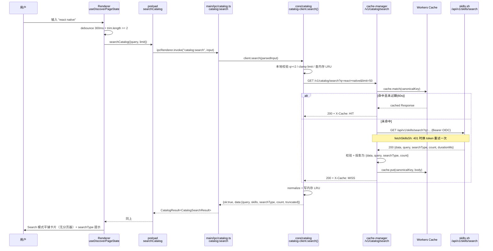
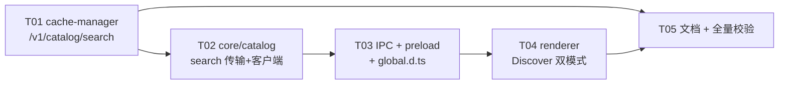

# Discover 搜索集成方案（skills.sh 真·搜索经 cache-manager）

- 日期：2026-08-05
- 作者：software-architect（Bob）
- 状态：**已拍板（8 项决策按推荐锁定），待实现 T01–T05（代码未动）**
- 关联 spec：`docs/superpowers/specs/2026-07-29-skills-sh-catalog-cache-design.md`
- 关联 artifact：`.workbuddy/artifacts/2026-08-04-discover-main-process-refactor-design.md`

---

## 1. TL;DR

**推荐走路线 A：在 cache-manager 新增 `GET /v1/catalog/search`，桌面经 IPC 消费，Discover 页改为 Browse / Search 双模式。**

两个决定性理由：

1. **桌面永远拿不到 Vercel OIDC token。** skills.sh 的鉴权是 Vercel 按请求签发的 OIDC JWT（`process.env.VERCEL_OIDC_TOKEN` / `x-vercel-oidc-token`），只在 Vercel 运行时或本地挂了 Vercel CLI 的机器上存在。Electron 跑在用户机器上，直连 `https://skills.sh/api/v1/skills/search` 必然 `401`。
2. **cache-manager 已经把这条链路建好了。** `apps/cache-manager/src/security/skills-sh-token.ts`（Token Broker + isolate 内缓存 + single-flight）+ `skills-sh-fetch.ts`（带一次 401 换 token 重试）已经在为 catalog 同步和 detail 代理服务，新增一个 search 路由**只是复用同一个 fetch 缝**，增量极小。

路线 B（桌面全量拉排行榜落 SQLite 本地搜索）**不推荐**：它会丢掉 skills.sh 的 semantic 搜索（本地只能做字符串匹配），并且需要新增表 + 首次全量同步 + 增量刷新 + 8.4k 条数据管理，代价远大于收益。可作为后续离线增强的 follow-up。

---

## 2. skills.sh 真实 API 摘要（来源：https://www.skills.sh/docs/api，2026-08-05 实读）

### 2.1 基础事实

| 项 | 事实 | 原文引用 |
|---|---|---|
| Base URL | `https://skills.sh`，端点在 `/api/v1/` 下，HTTPS，JSON | "All endpoints are under `/api/v1/` and served over HTTPS. Responses are JSON." |
| 鉴权 | Vercel OIDC Bearer JWT | "Vercel mints a short-lived JWT per request, scoped to your team and project, and we verify it against `oidc.vercel.com`." |
| Token 来源 | `process.env.VERCEL_OIDC_TOKEN` 或 `x-vercel-oidc-token` 头 | "Vercel will then expose the token at runtime as `process.env.VERCEL_OIDC_TOKEN` and as the `x-vercel-oidc-token` request header." |
| Token 生命周期 | ~12 小时轮换，请求作用域 | "The token is rotated roughly every 12 hours and is scoped to the active request context." |
| 本地开发 | 需 `vercel link` + `vercel env pull` | "`getVercelOidcToken()` works locally too, as long as the Vercel CLI is linked to your project." |
| 限流 | 已认证 600 req/min，per (team, project) | "Authenticated / 600 requests / minute / Per (team, project)" |
| 限流头 | `X-RateLimit-Limit` / `X-RateLimit-Remaining` / `X-RateLimit-Reset` | "Rate limit status is returned in every response via headers" |
| 429 | 带 `Retry-After` | "the API returns a `429 Too Many Requests` response with a `Retry-After` header." |
| 缓存 | leaderboard/search 30–60s；detail 5min；curated 5min | "The leaderboard and search endpoints cache for 30-60 seconds, the detail endpoint for 5 minutes, and the curated endpoint for 5 minutes." |
| 错误体 | `{ "error": "error_code", "message": "..." }` | "Error responses follow a consistent shape" |
| 状态码 | 400 参数非法 / 401 token 缺失过期 / 404 未找到 / 429 限流 / 503 暂不可用 | "401 Missing, invalid, or expired Vercel OIDC token." |

### 2.2 端点表

| 端点 | 参数 | 响应形状 |
|---|---|---|
| `GET /api/v1/skills` | `view`=`all-time`(默认)\|`trending`\|`hot`；`page` 0-indexed 默认 0；`per_page` 1–500 默认 **100** | `{ data: V1Skill[], pagination: { page, perPage, total, hasMore } }` |
| **`GET /api/v1/skills/search`** | **`q`（必填，最少 2 字符）；`limit` 1–200 默认 50；`owner` 可选 GitHub owner** | **`{ data: V1Skill[], query, searchType: "fuzzy"\|"semantic", count, durationMs }`，无 pagination** |
| `GET /api/v1/skills/curated` | 无 | `{ data: [{owner, totalInstalls, featuredRepo, featuredSkill, skills: V1Skill[]}], totalOwners, totalSkills, generatedAt }` |
| `GET /api/v1/skills/{source}/{skill}` | 路径参数 | `{ id, source, slug, installs, hash, files }`（**与 V1Skill 不同的最小形状**） |
| `GET /api/v1/skills/audit/{source}/{skill}` | 路径参数 | `{ id, source, slug, audits: [...] }`，无审计时 404 |

搜索语义原文："Single-word queries use fuzzy matching. Multi-word queries use semantic search for better relevance." 且 `searchType` 字段回传实际用的策略。

### 2.3 V1Skill 字段（listing + search 共用）

| 字段 | 类型 | 说明 |
|---|---|---|
| `id` | string | 稳定唯一 ID，格式 `{source}/{slug}`，可直接拼 detail 路径 |
| `slug` | string | URL 安全 slug |
| `name` | string | 人类可读名 |
| `source` | string | GitHub 为 `owner/repo`；well-known 为 `domain.com` |
| `installs` | integer | 去重安装数 |
| `sourceType` | `"github"` \| `"well-known"` | |
| `installUrl` | string \| null | |
| `url` | string | skills.sh 详情页 |
| `isDuplicate` | boolean（可选） | "Present and true if this skill is a detected fork/copy of another. Omitted when false." |

> ⚠️ **`isDuplicate` 是当前 `apps/desktop/src/core/catalog/catalog-types.ts` 的 `CatalogSkill` 里没有的字段**。search 结果里更容易出现 fork/副本，文档明确建议 "You may want to filter these out in your UI to show only original skills."。本方案把它列为**待拍板项**（见 §11）。

### 2.4 搜索的两个硬性限制（直接决定 UI 形态）

1. **`limit` 上限 200，且无 `page` 参数** → 搜索结果**没有分页**，最多 200 条一次性返回。
2. **`q` 最少 2 字符** → 单字符输入不能发请求，UI 必须在客户端就拦住。

---

## 3. 约束分析：为什么桌面必须经 cache-manager

### 3.1 桌面不能直连 skills.sh

- OIDC token 由 Vercel **按请求**签发，只存在于 Vercel 部署运行时（`process.env.VERCEL_OIDC_TOKEN`）或本地 Vercel CLI 会话中。
- Electron 应用分发到用户机器上，`VERCEL_OIDC_TOKEN` 永远为空 → 请求命中 `401 Missing, invalid, or expired Vercel OIDC token`。
- 不能把一个长期 token 打进安装包：它是 bearer 凭据（文档原话 "it is still a bearer credential"），且 ~12h 轮换，静态嵌入既不安全也不可用。
- 限流按 (team, project) 计算，所有桌面用户共享同一配额，必须有一层能做缓存与收敛的网关。

### 3.2 cache-manager 已是既定网关，且已具备全部前置件

代码事实（已核对）：

- `apps/cache-manager/src/security/skills-sh-token.ts:36` `createSkillsShTokenProvider`：POST `SKILLS_SH_TOKEN_URL`（Token Broker），校验 JWT `exp`，提前 60s 失效（`expirySkewSeconds = 60`），single-flight（`refreshPromise`）。
- `apps/cache-manager/src/security/skills-sh-fetch.ts:9` `fetchSkillsSh(url, bindings, tokenProvider, fetchImpl)`：带 Authorization 请求，**遇 401 自动 invalidate + 换 token 重试一次**。这是搜索路由可以直接复用的缝。
- `apps/cache-manager/src/app.ts:151-156`：`fetchImpl` / `tokenProvider` 都通过 `AppDependencies` 注入，测试可替换。
- `apps/cache-manager/src/app.ts:149` `app.use("*", withCors)`：CORS 中间件已覆盖全部路由，新路由零配置。
- spec `Runtime Topology` 段落已经把拓扑写死为 `Electron main process -> Cloudflare Worker (Hono) -> skills.sh`，并明确 "Electron renderer 直连 Worker" 属于 v1 排除项。

**结论：拓扑只能是 桌面 main process → cache-manager → skills.sh。renderer 不直连 Worker，main process 不直连 skills.sh。**

### 3.3 现有 Discover 数据流现状（已核对代码）

```
DiscoverPage (discover-page.tsx)
  └─ useDiscoverPageState (hooks/use-discover-page-state.ts)
       └─ window.skillsManager.getCatalogPage({page, forceRefresh})   ← preload.ts:77
            └─ ipcRenderer.invoke("catalog:getPage")                   ← main/ipc/catalog.ts:82
                 └─ catalogClient.getPage()                            ← core/catalog/catalog-client.ts:291
                      ├─ resolveGeneration() → fetchCatalogManifest()  ← catalog-http.ts:73
                      └─ fetchCatalogPage()                            ← catalog-http.ts:84
                           → GET {CATALOG_BASE_URL}/v1/catalog/{gen}/pages/{n}
  └─ filterSkills(skills, searchQuery)  ← discover-utils.ts:21 【当前的"搜索"= 页内 500 条客户端过滤】
```

`filterSkills` 只对**当前一页**做 `name/source/id` 的 `includes` 匹配（`discover-utils.ts:21-32`），i18n 文案也诚实地写着"在当前页 {{count}} 条中筛选"（`resources.ts:31`）。这不是搜索，是页内筛选。

---

## 4. 路线 A 详细设计（推荐）

### 4.0 端到端时序



### 4.1 cache-manager 侧

#### 4.1.1 路由路径：`GET /v1/catalog/search`

**必须避开 `/v1/skills/*`。** 已核对：`app.ts:266` 注册了 `app.get("/v1/skills/*")`，交给 `parseSkillReferencePath(path, "/v1/skills/")`。若把搜索挂在 `/v1/skills/search`，会被这条通配路由吞掉 —— `parseSkillReferencePath("/v1/skills/search", "/v1/skills/")` 得到 `segments=[]`、`skill="search"`，`parseSkillReference("", "search")` 因 `sourceValue` 为空返回 `null`，最终响应 `400 invalid_skill`。

选 `/v1/catalog/search`：
- 3 段路径，与 `/v1/catalog/:generation/pages/:page`（5 段、含 `/pages/` 字面量）无冲突；
- 语义上和 catalog 同族，桌面复用同一个 `CATALOG_BASE_URL`；
- 仍建议在 `app.ts` 中**注册在 `:generation` 路由之前**，靠位置进一步消除歧义风险。

#### 4.1.2 请求参数与校验

| 参数 | 规则 | 违规行为 |
|---|---|---|
| `q` | trim 后长度 `2..200` | `400 { error: "invalid_query" }` |
| `limit` | 整数，clamp 到 `1..200`，缺省 `50` | 非整数 → `400 invalid_limit`；越界 → clamp（不报错） |
| `owner` | 可选，匹配 `^[A-Za-z0-9][A-Za-z0-9._-]{0,99}$` | 违规 → `400 invalid_owner` |

> 上游 `limit` 上限就是 200，本地 clamp 可避免把明显越界的值透传上去浪费一次配额。

#### 4.1.3 复用现有 OIDC broker

```
fetchSkillsSh(
  buildSkillsShSearchUrl({ q, limit, owner }),   // 新增，encodeURIComponent 每个值
  bindings,
  tokenProvider,      // app.ts 里已构造好的同一个实例
  fetchImpl
)
```

**零新增鉴权代码。** `tokenProvider` 在 `createApp` 里是单例（`app.ts:152`），search 与 catalog sync / detail 共享同一份 isolate 内 token 缓存，不会额外打 Token Broker。

#### 4.1.4 缓存策略：实时代理 + 60s 短缓存，**不做 SWR**

决策：**实时代理**，不做分页快照、不落 KV。

理由：
1. 搜索**无分页且 ≤200 条**，单次响应体小（200 × ~200B ≈ 40KB），一次上游请求就能全量返回，没有"多页拼快照"的必要。
2. 查询空间无界。若像 catalog 那样落 KV 版本化快照，KV 写入会被任意查询词打爆，且 spec 明确把"任意搜索词的持久化缓存"列为 v1 排除项 —— **这一条排除项在路线 A 下依然成立**（我们不持久化），只需要把"semantic search 不在范围内"改掉。
3. 上游自己就是 30–60s 缓存，我们镜像同一档次即可。

实现：复用 `details/detail-cache.ts` 里的 `ResponseCache` 接口（`caches.default`），新建 `search/search-cache.ts`：

- **canonical cache key**：Workers Cache API 以完整 URL 为键，`?q=React` 与 `?q=react`、参数顺序不同都会各占一份。必须构造规范化键：
  ```
  https://cache.internal/v1/catalog/search?q=<lowercased+trimmed+collapsed-space>&limit=<n>&owner=<lowercased|"">
  ```
  参数按固定顺序拼接，缺省值也显式写入。
- **freshness 60s**（`searchFreshnessMs = 60_000`），存储侧 `cache-control: public, max-age=300`（Cache API 保留期），响应给客户端 `cache-control: public, max-age=<剩余秒数>`。
- **不做 stale-while-revalidate**：detail 走 SWR 是因为键空间有界（已安装/常看的技能）；search 键空间无界，后台刷新只会放大上游请求。过期即回源。
- `X-Cache: HIT | MISS` 头，与现有 catalog / detail 路由一致。
- 与 `detail-cache.ts` 一样，`cache.put` / `cache.match` 用 try/catch 包住 —— **缓存失败不能让一个合法的上游响应变成错误**。

#### 4.1.5 响应投影

校验上游 body 形状后**重新序列化**，只保留客户端契约需要的字段：

```jsonc
{
  "data": [ /* V1Skill[]，逐条要求 id 为非空 string，其余透传 */ ],
  "query": "react native",
  "searchType": "semantic",
  "count": 5
}
```

- 丢弃 `durationMs`（上游耗时，对 UI 无价值，且会让缓存体每次都不同不利于比对）。
- 形状非法（非对象 / `data` 非数组 / 缺 `searchType`）→ `502 { error: "invalid_search_response" }`，与 `detail-cache.ts:92` 的 `invalid_detail` 处理对称。

#### 4.1.6 错误映射

| 上游 / 情况 | cache-manager 响应 | 头 | 说明 |
|---|---|---|---|
| 本地参数非法 | `400 invalid_query` / `invalid_limit` / `invalid_owner` | `cache-control: no-store` | 不消耗上游配额 |
| 上游 `200` | `200` + 投影体 | `cache-control: public, max-age=60`，`X-Cache` | |
| 上游 `400` | `400 invalid_query` | `no-store` | 归一化，不透传上游 message |
| **上游 `401`** | **`503 search_unavailable`** | `no-store` | **绝不把 401 透给桌面**：401 只说明我们的 broker/token 坏了，是服务端故障，桌面显示"暂不可用 + 重试"才正确。`fetchSkillsSh` 已经自动换过一次 token，仍 401 即为配置故障。 |
| 上游 `429` | `429 rate_limited` | 透传 `Retry-After` + `X-RateLimit-*`，`no-store` | 让桌面能做退避 |
| 上游 `503` | `503 search_unavailable` | `no-store` | |
| 上游其他 5xx / fetch 抛错 | `502 search_unavailable` | `no-store` | 与 `detail-cache.ts:77` 的 `detail_unavailable` 同风格 |

透传头沿用 `detail-cache.ts:28` 的 `forwardedHeaders` 白名单（`content-type` / `retry-after` / `x-ratelimit-*`）。

#### 4.1.7 CORS

`withCors` 已 `app.use("*", ...)`（`app.ts:149`），新路由自动继承，**无需改动**。

### 4.2 desktop `core/catalog` 侧

#### 4.2.1 `catalog-types.ts`（零运行时，仅加类型）

```ts
/** 上游实际使用的搜索策略。单词 → fuzzy，多词 → semantic。 */
export type CatalogSearchType = "fuzzy" | "semantic";

export type CatalogSearchInput = {
  /** 原始输入；调用方无需 trim，客户端会归一化。 */
  query: string;
  /** 1..200，默认 50。越界会被 clamp。 */
  limit?: number;
  /** 可选 GitHub owner 过滤。 */
  owner?: string;
};

export type CatalogSearchResult = {
  /** 服务端回显的规范化 query，用于 UI 展示"关于 xxx 的结果"。 */
  query: string;
  skills: CatalogSkill[];
  searchType: CatalogSearchType;
  count: number;
  /** count 已达 limit 上限，可能还有更多结果 → UI 提示"请细化关键词"。 */
  truncated: boolean;
};
```

`CatalogErrorCode` 追加两个成员：

```ts
export type CatalogErrorCode =
  | "config" | "warming" | "not-found" | "unavailable"
  | "network" | "invalid-response" | "unknown"
  | "invalid-query"    // 新增：q < 2 字符 / owner 非法（本地即可判定，不发请求）
  | "rate-limited";    // 新增：429，携带 retryAfterSeconds
```

> 这是**向后兼容的联合类型扩展**：`discover-page-main.tsx:32` 的 `errorMessageKey` 有 `default` 分支，不加处理也不会崩，只是文案退化为通用错误 —— 但我们会补上专属文案。

**注意 search 的返回形状与分页 list 根本不同**：没有 `generation`、没有 `pagination`、没有 `isFallback`。因此 `CatalogSearchResult` **不复用** `CatalogGenerationInfo`，Search 模式下 UI 也不该显示 stale 提示。

#### 4.2.2 `catalog-http.ts`

新增：

```ts
export const CATALOG_SEARCH_MIN_QUERY_LENGTH = 2;
export const CATALOG_SEARCH_MAX_LIMIT = 200;
export const CATALOG_SEARCH_DEFAULT_LIMIT = 50;

export type CatalogSearchHttpOptions = CatalogHttpOptions & {
  query: string;      // 已 trim / 已校验
  limit: number;      // 已 clamp
  owner?: string;
};

export const buildSearchUrl = (baseUrl, { query, limit, owner }): string =>
  `${normalizeCatalogBaseUrl(baseUrl)}/v1/catalog/search`
  + `?q=${encodeURIComponent(query)}&limit=${limit}`
  + (owner ? `&owner=${encodeURIComponent(owner)}` : "");

export const fetchCatalogSearch = async (
  options: CatalogSearchHttpOptions
): Promise<CatalogSearchPayload> => { /* performRequest → assert → readJson → normalize */ };

export const normalizeCatalogSearch = (value: unknown): CatalogSearchPayload => { ... };
```

- **复用现有 fetch 缝**：`performRequest`（`catalog-http.ts:118`，含 `AbortSignal.timeout` 降级）、`readJson`、`describeError` 全部原样复用。
- **复用 `normalizeCatalogSkill`**（`catalog-http.ts:184`，目前是模块私有，改为 export 或保持私有由同文件内调用即可 —— 同文件内调用，无需 export）。宽松归一化策略保持一致：只硬校验 `id`，其余字段给默认值。
- **扩展 `assertSuccessfulResponse`**（当前 `catalog-http.ts:129`）新增两个分支：
  ```ts
  if (response.status === 400) throw new CatalogHttpError("invalid-query", `${context} rejected the query.`);
  if (response.status === 429) throw new CatalogHttpError("rate-limited", `${context} was rate limited.`,
      parseRetryAfterSeconds(response.headers.get("retry-after")));
  ```
  manifest / page 路由今天不会返回 400/429，加上去只会让分类更准，不改变现有行为。`parseRetryAfterSeconds`（`catalog-http.ts:57`）已经把值 clamp 到 `[1,10]` 秒，可直接复用。
- `searchType` 归一化：非 `"fuzzy"` 一律视作 `"semantic"`（或反之），不因未知值抛错。

#### 4.2.3 `catalog-client.ts`

```ts
export type CatalogClient = {
  getManifest(options?): Promise<CatalogResult<CatalogManifestResult>>;
  getPage(input): Promise<CatalogResult<CatalogPageResult>>;
  search(input: CatalogSearchInput): Promise<CatalogResult<CatalogSearchResult>>;  // 新增
  reset(): void;
};
```

行为规范：

1. **不碰 manifest / generation / pageCache。** search 是独立路径，`resolveGeneration()` 完全不参与。这点很关键：搜索失败不应污染浏览态的 generation 锁。
2. **本地前置校验**（不发网络请求）：
   - `query.trim()` 折叠连续空白后长度 `< 2` → `{ ok: false, error: { code: "invalid-query", message: "Search query must be at least 2 characters." } }`
   - `owner` 提供但不匹配 `^[A-Za-z0-9][A-Za-z0-9._-]{0,99}$` → 同上 `invalid-query`
   - `limit`：非有限数 → 用默认 50；否则 `clamp(trunc(limit), 1, 200)`
3. **预算**：复用 `assertBaseUrl()`；单次 HTTP 超时 `CATALOG_REQUEST_TIMEOUT_MS = 15_000`；整次调用预算 `CATALOG_CALL_BUDGET_MS = 25_000`。**新增一个独立退避轴** `CATALOG_MAX_SEARCH_RETRY_ATTEMPTS = 1`：仅 `rate-limited` 触发一次按 `Retry-After` 的退避重试；`warming` 在 search 路径上不会出现（不依赖 KV 快照），若出现按同一轴处理。**不做 fallback，不做 manifest refresh** —— 那两轴对 search 无意义。
4. **可选：小 LRU 结果缓存。** `Map<string, {payload, fetchedAt}>`，键 `${normalizedQuery}|${limit}|${owner ?? ""}`，容量 8，TTL 60s（与 Worker 侧对齐）。收益：用户删字再补回、切走再切回不重复打网络。`reset()` 一并清空。**这是 nice-to-have，可在 T02 里一并做，也可砍掉**（见 §11 待拍板项）。
5. `truncated = count >= limit`。

#### 4.2.4 IPC：`catalog:search`

`apps/desktop/src/main/ipc/catalog.ts`，与现有两个 handler 完全同构：

```ts
/** renderer 输入不可信：与 parsePageInput 同样的防御姿态。 */
const parseSearchInput = (input: unknown): CatalogSearchInput | null => {
  if (typeof input !== "object" || input === null) return null;
  const candidate = input as Partial<CatalogSearchInput>;
  if (typeof candidate.query !== "string") return null;
  const limit = candidate.limit;
  if (limit !== undefined && !Number.isFinite(limit)) return null;
  const owner = candidate.owner;
  if (owner !== undefined && typeof owner !== "string") return null;
  return {
    query: candidate.query,
    ...(limit === undefined ? {} : { limit }),
    ...(owner === undefined ? {} : { owner })
  };
};

export const searchCatalog = async (
  client: CatalogClient,
  input: unknown
): Promise<CatalogResult<CatalogSearchResult>> => {
  const parsed = parseSearchInput(input);
  if (!parsed) {
    return { ok: false, error: { code: "invalid-query", message: "Invalid catalog search input." } };
  }
  try {
    return await client.search(parsed);
  } catch (error: unknown) {
    console.error("Failed to search the catalog.", error);
    return unknownFailure(error);            // 复用 catalog.ts:13
  }
};

// registerCatalogIpc 内追加：
ipcMain.handle("catalog:search", (_event, input: unknown) => searchCatalog(client, input));
```

**handler 永不 reject** —— 与现有两个 channel 的契约完全一致（`catalog.ts:13-19` 的 `unknownFailure` 兜底）。同时在文件顶部的 `export type { ... }` 里补上 `CatalogSearchInput` / `CatalogSearchResult`（`catalog.ts:11` 的既有再导出模式）。

#### 4.2.5 preload

`apps/desktop/src/main/preload.ts`，跟 `catalog.ts:75-78` 同款类型化 invoke 转发：

```ts
searchCatalog: (input: CatalogSearchInput) =>
  ipcRenderer.invoke("catalog:search", input) as Promise<CatalogResult<CatalogSearchResult>>,
```

import 从 `./ipc/catalog` 补 `CatalogSearchInput` / `CatalogSearchResult`。

#### 4.2.6 `renderer/global.d.ts`

沿用现有"从 `core/catalog/catalog-types.js` 取零运行时类型 + 从 `main/ipc/catalog` 取 IPC 类型"的双通道模式（`global.d.ts:24-35`）：

```ts
export type CatalogSearchInput = CoreCatalogSearchInput;
export type CatalogSearchResult = CoreCatalogSearchResult;
export type CatalogSearchType = CoreCatalogSearchType;

// Window.skillsManager 内：
searchCatalog?: (input: CatalogSearchInput) => Promise<CatalogResult<CatalogSearchResult>>;
```

**renderer 只 import `catalog-types.ts` 的类型**，绝不触碰 `catalog-http.ts` / `catalog-client.ts`（后者含 Node fetch，会污染 renderer program）—— 这条硬约束在 `catalog-types.ts:1-9` 的头注释里写死了。

### 4.3 renderer Discover UI：Browse / Search 双模式

#### 4.3.1 状态机

```
                 输入 trim 长度 >= 2（debounce 后）
   ┌── Browse ─────────────────────────────────► Search ──┐
   │   分页排行榜                                  平铺 <=200  │
   │   getCatalogPage({page})                     searchCatalog({query})
   │   显示分页器 / stale 提示                      隐藏分页器 / 隐藏 stale
   └◄──────────── 输入清空或 trim 长度 < 2 ─────────────────┘
```

`mode` **派生自 `submittedQuery`**（debounce 后的值），不作为独立 state：

```ts
const mode: "browse" | "search" =
  submittedQuery.trim().length >= 2 ? "search" : "browse";
```

这样不会出现 "mode 已切但 query 还没跟上" 的中间态。

#### 4.3.2 搜索框交互

| 问题 | 决策 | 理由 |
|---|---|---|
| debounce? | **是，300ms** | semantic 搜索有真实上游成本（600 req/min 全用户共享配额）。300ms 是"敲完一个词"的常见节奏。 |
| 最少 2 字符才发请求? | **是** | 上游硬性要求 `q` ≥ 2；`<2` 直接停在 Browse 模式，不发请求也不报错。 |
| 回车立即搜索? | **是** | `onKeyDown === "Enter"` 跳过 debounce 立即提交，键盘用户体验更好。 |
| 清空后? | 立即回 Browse，展示原来的 `page` 数据 | Browse 的 `skills` / `page` state 保留不清，回退零延迟。 |
| Search 模式还叠加 `filterSkills` 吗? | **不叠加** | 服务端 semantic 结果是权威排序，客户端再按 `includes` 过滤会把语义命中的（名字里没有关键词的）结果误杀 —— 这恰恰是 semantic 搜索的价值所在。 |

#### 4.3.3 `filterSkills` 的去留

改造后 `filterSkills` 在两种模式下都不再被调用：Browse 模式搜索框已经交给服务端，Search 模式不叠加。

推荐：**从 `use-discover-page-state.ts` 移除调用**，`discover-utils.ts` 中的 `filterSkills` 及其单测一并删除（`formatCompact` 保留，`discover-page-main.tsx:14` 还在用）。同时把 i18n key `discover.searchPlaceholderPage`（"在当前页 {{count}} 条中筛选"）换成 `discover.searchPlaceholder`（"搜索全部技能…"），`searchAriaLabel` 文案同步调整 —— 现在的文案会误导用户以为还是页内筛选。

> 保留 `filterSkills` 作为 Search 模式的二次筛选是个**待拍板项**（§11）。我的建议是删掉。

#### 4.3.4 hook 契约（`use-discover-page-state.ts`）

新增 / 变更的返回值：

```ts
{
  mode: "browse" | "search",
  // Search 模式专属
  searchType: CatalogSearchType | null,
  resultCount: number,
  truncated: boolean,
  // 既有
  skills, status, errorCode, searchQuery, setSearchQuery,
  totalCount, formattedTotal, isStale, page, pageCount, setPage, refetch
}
```

关键实现点：

1. **复用同一个 `requestIdRef`**（`use-discover-page-state.ts:27`）跨两种模式自增。这样一个迟到的 browse 响应绝不会覆盖刚发出的 search 结果，反之亦然 —— 这是双模式下最容易出的 bug。
2. **`isStale` 在 Search 模式恒为 false**：search 响应没有 generation，也就不存在 fallback 概念。
3. **`notFoundRecoveredRef` 的 404 自愈逻辑只属于 Browse**（`use-discover-page-state.ts:62-70`），search 路径不进入。
4. **`refetch` 按当前 mode 分派**：Browse → `load(page, true)`；Search → 重发同一 query（且绕过客户端 LRU，可加 `forceRefresh` 或直接不进 LRU）。
5. debounce 用 `useEffect` + `setTimeout` + cleanup，**卸载时清定时器**。
6. `window.skillsManager?.searchCatalog` 缺失时（preload 未注入）→ `status="error"`, `errorCode="unknown"`，与 `getCatalogPage` 的缺失处理（`use-discover-page-state.ts:37-42`）同构。

#### 4.3.5 `discover-page-main.tsx` 展示层

| 区域 | Browse | Search |
|---|---|---|
| 搜索框 placeholder | `discover.searchPlaceholder`（"搜索全部技能…"） | 同 |
| stale 提示 | 按 `isStale` 显示 | **不显示** |
| 结果摘要条 | 现有（无，或 total） | 新增一行：`discover.search.summary` = "找到 {{count}} 个结果（{{type}} 匹配）"；`truncated` 时追加 `discover.search.truncated` = "仅显示前 {{limit}} 条，请细化关键词" |
| 卡片网格 | 不变 | 不变（同一个 `SkillCard`） |
| **分页器** | `pageCount > 1` 时显示 | **恒不显示** |
| 空态 | `discover.empty` | `discover.search.empty` = "没有找到与 \"{{query}}\" 匹配的技能。" |
| 错误态 | 现有 | 同一个错误块 + 重试按钮，`errorMessageKey` 补两个分支 |

`errorMessageKey`（`discover-page-main.tsx:32`）补：

```ts
case "invalid-query": return "discover.errors.invalidQuery";   // "请输入至少 2 个字符。"
case "rate-limited":  return "discover.errors.rateLimited";    // "请求过于频繁，请稍后重试。"
```

i18n 需要在 `resources.ts` 的 **zh 与 en 两份**里同步补齐（现有结构见 `resources.ts:28` 与 `resources.ts:541`）。

#### 4.3.6 base URL

**不新增任何配置。** search 走 `apps/desktop/src/core/app-constants.ts:29` 的同一个 `CATALOG_BASE_URL`（`https://skills-manager-cache-manager.mockplus.workers.dev`），`resolveCatalogBaseUrl()` 的 `SKILLS_MANAGER_CATALOG_BASE_URL` 覆盖同样生效。

---

## 5. 路线 B：桌面本地 SQLite 全量目录 + 本地搜索（不推荐）

### 5.1 设计要点

| 项 | 内容 |
|---|---|
| 新增表 | `catalog_skills(id PK, slug, name, source, installs, source_type, install_url, url, generation, synced_at)`；可选 FTS5 虚表 `catalog_skills_fts(name, source, id)` |
| 迁移 | `drizzle-kit generate`，新增 schema 文件 + migration SQL |
| 首次同步 | 首次进入 Discover 时全量拉 17 页（8,420 条 / 500 条每页），串行 + 进度提示；耗时约 17 × RTT |
| 增量刷新 | generation 变化时整代重灌；或按 TTL（6h）后台重灌。需要事务 + 旧代清理 |
| 搜索实现 | `filterSkills` → SQL `LIKE '%q%'` 或 FTS5 `MATCH`；排序按 `installs DESC` |
| 涉及文件 | `core/db/schema/*`、新 `core/catalog/catalog-store.ts`、`core/catalog/catalog-sync.ts`、`main/ipc/catalog.ts`、drizzle migration、`use-discover-page-state.ts` |

### 5.2 代价与风险（不推荐的理由）

1. **丢失 semantic 搜索。** 这是最致命的一条。上游多词查询走 semantic（"Multi-word queries use semantic search for better relevance"），本地 SQLite 只能做字符串匹配 / FTS 分词。用户搜 "react native" 时，semantic 能命中名字里没这两个词但语义相关的技能，本地实现做不到。**路线 B 是能力降级，不是等价替换。**
2. **首次体验劣化。** 首次进 Discover 要串行拉 17 页才能搜索，而路线 A 打开即可搜。
3. **数据新鲜度问题。** 本地快照与线上排行榜必然漂移，需要额外的 TTL / generation 协商逻辑，而这套逻辑 cache-manager 已经做过一遍了 —— 等于在桌面再实现一遍服务端已有的能力。
4. **存储与写入成本。** 8.4k 行 × 每 6h 全量重灌，SQLite 事务与旧代清理都要写；`isDuplicate` 之类的字段变更还要迁移。
5. **改动面更大。** 涉及 DB schema + migration + 同步引擎 + IPC + UI，是路线 A 的 2–3 倍工作量，且新增了一个需要长期维护的数据同步子系统。

### 5.3 路线 B 的唯一优势与定位

优势：**离线可用** + 搜索零网络延迟 + 完全不占用上游配额。

定位：如果后续产品要做"离线浏览已知目录"，可以在路线 A 落地后作为**增强层**叠加 —— 本地 DB 承担离线兜底与 instant 前缀补全，在线时仍走服务端 semantic 搜索。两者不冲突，但**不应该先做 B**。

---

## 6. 文件级改动清单（路线 A）

### 6.1 cache-manager 侧（`apps/cache-manager/`）

| 文件 | 状态 | 职责 |
|---|---|---|
| `src/search/search-query.ts` | **新增** | 解析/校验 `q`/`limit`/`owner`，构造 skills.sh 搜索 URL，投影上游响应体为 `{data, query, searchType, count}` |
| `src/search/search-cache.ts` | **新增** | Workers Cache API 读写 + canonical cache key 归一化 + 60s freshness + `X-Cache` 头 + 错误映射（401→503、429 透传、5xx→502） |
| `src/search/search-query.test.ts` | **新增** | 参数校验与 URL 构造、响应投影的纯函数单测 |
| `src/app.ts` | 修改 | 注册 `app.get("/v1/catalog/search", ...)`（置于 `:generation` 路由之前），把 `tokenProvider` / `fetchImpl` / `waitUntil` / 缓存实例注入 search handler |
| `src/app.test.ts` | 修改 | 新增 search 路由集成测试（见 §8.1） |
| `README.md` | 修改 | API 清单补 `GET /v1/catalog/search`；"External Token Broker" 段落的上游 URL 列表补 `/api/v1/skills/search` |

> 不需要改 `worker-env.ts`（无新 binding）、不需要改 `withCors`、不需要改 KV keys。

### 6.2 desktop 侧（`apps/desktop/src/`）

| 文件 | 状态 | 职责 |
|---|---|---|
| `core/catalog/catalog-types.ts` | 修改 | 新增 `CatalogSearchType` / `CatalogSearchInput` / `CatalogSearchResult`；`CatalogErrorCode` 追加 `"invalid-query"` / `"rate-limited"`。**保持零运行时** |
| `core/catalog/catalog-http.ts` | 修改 | 新增 `buildSearchUrl` / `fetchCatalogSearch` / `normalizeCatalogSearch` + 搜索常量；`assertSuccessfulResponse` 增加 400/429 分支 |
| `core/catalog/catalog-http.test.ts` | 修改 | 搜索 URL 构造、响应归一化、400/429 分类的单测 |
| `core/catalog/catalog-client.ts` | 修改 | 新增 `search()`：本地校验 + clamp + 单轴 429 退避 + 可选 60s LRU；`reset()` 清 LRU |
| `core/catalog/catalog-client.test.ts` | 修改 | `search()` 全路径单测（见 §8.2） |
| `main/ipc/catalog.ts` | 修改 | 新增 `parseSearchInput` / `searchCatalog` / `catalog:search` handler，再导出新类型 |
| `main/ipc/catalog.test.ts` | 修改 | `catalog:search` 输入防御与不 reject 契约测试 |
| `main/preload.ts` | 修改 | 暴露 `searchCatalog` |
| `renderer/global.d.ts` | 修改 | 导出搜索类型 + `Window.skillsManager.searchCatalog?` |
| `renderer/features/discover/hooks/use-discover-page-state.ts` | 修改 | Browse/Search 双模式状态机、debounce、共享 requestId 竞态守卫、移除 `filterSkills` 调用 |
| `renderer/features/discover/components/discover-page-main.tsx` | 修改 | 双模式渲染：Search 模式隐藏分页器与 stale 提示、新增结果摘要条、扩展 `errorMessageKey` |
| `renderer/features/discover/discover-page.tsx` | 修改 | 透传新增的 `mode` / `searchType` / `resultCount` / `truncated` props |
| `renderer/features/discover/discover-utils.ts` | 修改 | 删除 `filterSkills`（保留 `formatCompact`）※ 依 §11 拍板 |
| `renderer/features/discover/discover-utils.test.ts` | 修改 | 删除 `filterSkills` 相关用例 ※ 同上 |
| `renderer/features/discover/discover-page.test.tsx` | 修改 | 新增 Search 模式测试（见 §8.4） |
| `renderer/i18n/resources.ts` | 修改 | zh / en 各补 `discover.searchPlaceholder`、`discover.search.{summary,empty,truncated,typeFuzzy,typeSemantic}`、`discover.errors.{invalidQuery,rateLimited}` |

> `core/app-constants.ts` **不改** —— 复用 `CATALOG_BASE_URL`。

### 6.3 文档

| 文件 | 状态 | 职责 |
|---|---|---|
| `docs/superpowers/specs/2026-07-29-skills-sh-catalog-cache-design.md` | 修改 | 见 §9 |
| `AGENTS.md` | 修改 | 见 §9 |

---

## 7. 有序任务分解（≤5 个任务）

### T01 — cache-manager 搜索路由

- **文件**：`src/search/search-query.ts`（新）、`src/search/search-cache.ts`（新）、`src/search/search-query.test.ts`（新）、`src/app.ts`、`src/app.test.ts`、`README.md`
- **依赖**：无
- **优先级**：P0
- **验收要点**
  1. `GET /v1/catalog/search?q=react` 返回 `{data, query, searchType, count}`，`X-Cache: MISS`，`cache-control: public, max-age=60`
  2. 同一查询 60s 内二次请求 `X-Cache: HIT` 且**不再打上游**（`fetchImpl` 调用次数为 1）
  3. `q=r`（1 字符）/ 缺 `q` → `400 invalid_query`，**不调用 `fetchImpl`**
  4. `limit=9999` 被 clamp 到 200；`limit=abc` → `400 invalid_limit`；`owner=../etc` → `400 invalid_owner`
  5. 上游 401 → 桌面侧收到 **503 `search_unavailable`**（不泄露 401）
  6. 上游 429 → 429 + 透传 `Retry-After` / `X-RateLimit-*`，`cache-control: no-store`
  7. 上游返回畸形 body → `502 invalid_search_response`
  8. `?q=React` 与 `?q=react%20` 命中**同一条** cache 记录（canonical key 生效）
  9. `/v1/skills/*` detail 路由行为未回归（现有 app.test.ts 全绿）
  10. `pnpm --filter @skills-manager/cache-manager run check|test|build` 全绿

### T02 — desktop core/catalog 搜索传输与客户端

- **文件**：`core/catalog/catalog-types.ts`、`catalog-http.ts`、`catalog-http.test.ts`、`catalog-client.ts`、`catalog-client.test.ts`
- **依赖**：T01（契约确定后再写归一化；可与 T01 并行开发，但需在 T01 契约冻结后收敛）
- **优先级**：P0
- **验收要点**
  1. `catalog-types.ts` 仍**零运行时**（无 import、无 value 导出）
  2. `buildSearchUrl` 正确 `encodeURIComponent`（空格 → `%20`，`owner` 缺省时不带该参数）
  3. `search({query: "a"})` **不发请求**，直接返回 `{ok:false, error.code:"invalid-query"}`
  4. `limit` 越界被 clamp 到 `[1,200]`，缺省 50
  5. 429 触发一次 `Retry-After` 退避重试，第二次仍 429 → `{ok:false, error:{code:"rate-limited", retryAfterSeconds}}`
  6. `count >= limit` 时 `truncated === true`
  7. search 失败**不污染** `activeGeneration` / `pageCache`（搜索报错后 `getPage` 仍正常）
  8. `reset()` 清空 search LRU
  9. 现有 `getManifest` / `getPage` 测试全绿（`assertSuccessfulResponse` 扩展无回归）

### T03 — IPC + preload + 类型声明

- **文件**：`main/ipc/catalog.ts`、`main/ipc/catalog.test.ts`、`main/preload.ts`、`renderer/global.d.ts`
- **依赖**：T02
- **优先级**：P0
- **验收要点**
  1. `catalog:search` handler **永不 reject**：client 抛错时返回 `{ok:false, error.code:"unknown"}`
  2. 非法输入（`null` / `{}` / `{query: 123}` / `{limit: NaN}`）→ `{ok:false, error.code:"invalid-query"}`，不调用 client
  3. `pnpm --filter @skills-manager/desktop run build:main` 通过（preload 类型闭合）
  4. `tsc -p tsconfig.renderer.json --noEmit` 通过，且 renderer program **未拉入** `catalog-http.ts` / `catalog-client.ts`

### T04 — renderer Discover 双模式 UI

- **文件**：`hooks/use-discover-page-state.ts`、`components/discover-page-main.tsx`、`discover-page.tsx`、`discover-utils.ts`、`discover-utils.test.ts`、`discover-page.test.tsx`、`renderer/i18n/resources.ts`
- **依赖**：T03
- **优先级**：P0
- **验收要点**
  1. 输入 ≥2 字符、debounce 后**恰好调用一次** `searchCatalog`（连续快打不产生多次调用）
  2. 输入 1 字符**不调用** `searchCatalog`，停留 Browse
  3. Search 模式下**分页器不在 DOM 中**、stale 提示不显示
  4. 清空搜索框 → 回到 Browse，原页数据仍在，`getCatalogPage` 不被重复调用
  5. Search 空结果显示 `discover.search.empty` 且带 query 回显
  6. Search 错误后点"重试"重发同一 query 并恢复成功态
  7. 迟到的 browse 响应不会覆盖已渲染的 search 结果（requestId 守卫）
  8. zh / en 两份 i18n key 完整，无缺键告警

### T05 — 文档与端到端校验

- **文件**：`docs/superpowers/specs/2026-07-29-skills-sh-catalog-cache-design.md`、`AGENTS.md`、`apps/cache-manager/README.md`（若 T01 未覆盖完）
- **依赖**：T01、T04
- **优先级**：P1
- **验收要点**
  1. spec 的 v1 排除项中 "semantic search、curated、trending、hot 或 audit" 一条被拆分修订（见 §9）
  2. spec "Desktop consumer contract" 段的 "搜索仅在当前页 500 条内做本地过滤；服务端搜索仍不在范围内"（line 145 附近）被改写
  3. AGENTS.md 补 Discover 搜索说明
  4. `pnpm --filter @skills-manager/cache-manager run check|test|build|format:check` 全绿
  5. `pnpm --filter @skills-manager/desktop run check|build:main|test|format:check` 全绿

**依赖图**



> ⏸️ **实现延期说明**：spec（`docs/superpowers/specs/2026-07-29-skills-sh-catalog-cache-design.md`）与 `AGENTS.md` 的改动属于 **T05 实现阶段**（见 §9、T05）。按用户"先不要实现"的要求，**T01–T05 的代码与文档改动一律延期执行**；本次（2026-08-05）仅更新本方案文档，未触碰任何项目源码/文档文件。

---

## 8. 测试清单

### 8.1 cache-manager `src/app.test.ts` + `src/search/search-query.test.ts`

沿用现有测试基建：`MemoryKv`（`src/test/memory-kv.ts`）、`MemoryResponseCache`（`app.test.ts:10`）、`createTokenProvider()` mock（`app.test.ts:24`）、`createApp({ now, fetchImpl, tokenProvider, detailCache })` 依赖注入。

| # | 用例 | 断言 |
|---|---|---|
| 1 | 正常搜索 | 200 + `{data, query, searchType, count}`；`X-Cache: MISS`；上游 URL 含 `q=react&limit=50` |
| 2 | 缓存命中 | 60s 内二次请求 `X-Cache: HIT`，`fetchImpl` 只被调用 1 次 |
| 3 | 缓存过期 | `now` 前进 61s 后再请求 → `X-Cache: MISS`，`fetchImpl` 2 次 |
| 4 | canonical key | `?q=React` 与 `?q=%20react%20` 命中同一缓存条目 |
| 5 | `q` 太短 / 缺失 | 400 `invalid_query`，`fetchImpl` 0 次 |
| 6 | `limit` clamp | `limit=9999` → 上游 URL 里是 `limit=200` |
| 7 | `limit` 非法 | `limit=abc` → 400 `invalid_limit` |
| 8 | `owner` 非法 | `owner=a/b` → 400 `invalid_owner`；`owner=expo` → 上游 URL 含 `owner=expo` |
| 9 | 上游 401 | 响应 **503 `search_unavailable`**，body 不含 "401"/token 字样 |
| 10 | 上游 429 | 429 + `Retry-After` / `X-RateLimit-*` 透传，`cache-control: no-store` |
| 11 | 上游 503 | 503 `search_unavailable` |
| 12 | 上游 fetch 抛错 | 502 `search_unavailable`，不抛到 Hono |
| 13 | 上游 body 畸形 | 502 `invalid_search_response` |
| 14 | 缓存写入抛错 | 仍返回 200（缓存故障不影响正确响应） |
| 15 | CORS | 响应带 `Access-Control-Allow-Origin` |
| 16 | 路由隔离 | `/v1/skills/vercel-labs/skills/find-skills` detail 行为不变 |

### 8.2 desktop `core/catalog/catalog-client.test.ts`（search 部分）

| # | 用例 | 断言 |
|---|---|---|
| 1 | `q` 1 字符 / 全空白 | `{ok:false, code:"invalid-query"}`，`fetchImpl` 0 次 |
| 2 | `owner` 非法 | 同上 |
| 3 | 正常搜索 | `{ok:true, data:{query, skills, searchType, count, truncated:false}}` |
| 4 | `count >= limit` | `truncated === true` |
| 5 | limit clamp | `limit: 0` → 请求 URL `limit=1`；`limit: 500` → `limit=200`；未传 → `limit=50` |
| 6 | 429 退避重试 | 第一次 429（`Retry-After: 3`）→ `sleep(3000)` 被调用 → 第二次 200 成功；退避轴只用一次 |
| 7 | 连续 429 | 第二次仍 429 → `{ok:false, code:"rate-limited", retryAfterSeconds:3}` |
| 8 | `Retry-After` clamp | `Retry-After: 999` → 退避 10s（`MAX_RETRY_AFTER_SECONDS`） |
| 9 | 503 | `{ok:false, code:"unavailable"}`，**不触发 generation fallback** |
| 10 | 网络抛错 | `{ok:false, code:"network"}` |
| 11 | 畸形 JSON | `{ok:false, code:"invalid-response"}` |
| 12 | base URL 未配置 | `{ok:false, code:"config"}` |
| 13 | 超预算 | `now` 越过 `deadlineAt` → `{ok:false, code:"network"}` |
| 14 | 状态隔离 | search 报错后 `getPage` 仍能正常取页（`activeGeneration` 未被清） |
| 15 | LRU 命中 | 同 query 60s 内二次调用 `fetchImpl` 只 1 次 ※ 若采纳 LRU |
| 16 | `reset()` | 清空 LRU，下次重新请求 ※ 同上 |

`catalog-http.test.ts` 补：`buildSearchUrl` 编码、`normalizeCatalogSearch` 丢弃无 `id` 的条目、`searchType` 未知值归一、400/429 的 `CatalogHttpError.code` 分类。

### 8.3 desktop `main/ipc/catalog.test.ts`

| # | 用例 | 断言 |
|---|---|---|
| 1 | 合法输入 | 转发给 `client.search`，原样返回其结果 |
| 2 | `null` / 非对象 / `{query: 123}` / `{limit: NaN}` / `{owner: 1}` | `{ok:false, code:"invalid-query"}`，client 未被调用 |
| 3 | client 抛错 | `{ok:false, code:"unknown"}`，**handler 不 reject** |
| 4 | `registerCatalogIpc` | `ipcMain.handle` 被以 `"catalog:search"` 注册 |

### 8.4 desktop `renderer/features/discover/discover-page.test.tsx`

沿用现有 `setupWindow()` 模式（`discover-page.test.tsx:50`），扩展为同时注入 `getCatalogPage` 与 `searchCatalog`。**记得用 `vi.useFakeTimers()` 推进 debounce。**

| # | 用例 | 断言 |
|---|---|---|
| 1 | 输入 "react" + 推进 300ms | `searchCatalog` 被调用 1 次，参数 `{query:"react"}` |
| 2 | 快速连打 "r"→"re"→"rea" | 只调用 1 次，query 为最终值 |
| 3 | 输入 "r"（1 字符） | `searchCatalog` **未被调用**，仍显示 Browse 的卡片与分页器 |
| 4 | Search 成功 | 渲染结果卡片；`queryByLabelText(下一页)` 为 `null`（**无分页器**） |
| 5 | Search 空结果 | 显示空态文案且包含 query |
| 6 | Search 错误 → 重试 | 显示错误块；点重试后 `searchCatalog` 第二次调用，成功后渲染卡片 |
| 7 | 清空搜索框 | 回 Browse，分页器重新出现，`getCatalogPage` 未被多余调用 |
| 8 | Enter 立即搜索 | 不等 debounce 即调用 |
| 9 | Search 模式无 stale 提示 | 即便 browse 态 `isFallback` 为 true，Search 模式下 `discover.staleNotice` 不在 DOM |
| 10 | `truncated` 提示 | `count === limit` 时显示"请细化关键词" |
| 11 | `searchType` 提示 | 单词 → "fuzzy" 文案；多词 → "semantic" 文案 |
| 12 | 竞态 | 先发 search（慢）后清空回 browse（快）→ 迟到的 search 响应不覆盖 browse 列表 |

---

## 9. 需更新的文档

### 9.1 `docs/superpowers/specs/2026-07-29-skills-sh-catalog-cache-design.md`

| 位置 | 现文 | 建议改为 |
|---|---|---|
| `## Scope` → "第一版不包含" 列表（约 line 25） | `- 任意搜索词的持久化缓存。`<br/>`- semantic search、curated、trending、hot 或 audit。` | `- 任意搜索词的**持久化**缓存（KV 版本化快照）。搜索走实时代理 + 60s Workers Cache，不落 KV。`<br/>`- curated、trending、hot 或 audit。`<br/>※ **"semantic search" 从排除项移除** |
| `## Scope` → "第一版包含" 列表 | — | 追加：`- 经 cache-manager 代理的 skills.sh 搜索 API（GET /v1/catalog/search），复用同一 OIDC Token Broker 与 Workers Cache。` |
| `## Runtime Topology` 代码块 | 仅 catalog / detail | 补一行搜索链路：`Electron main process -> Worker /v1/catalog/search -> skills.sh /api/v1/skills/search` |
| Desktop consumer contract → "缓存与展示"（约 line 145） | `- 搜索仅在当前页 500 条内做本地过滤；服务端搜索仍不在范围内` | `- 搜索经 cache-manager 的 /v1/catalog/search 走 skills.sh 服务端搜索（单词 fuzzy / 多词 semantic），最多 200 条、无分页；Discover 为 Browse / Search 双模式，Search 模式不叠加客户端过滤` |
| Desktop consumer contract → 退避预算 | 三轴 | 追加：`- search 独立一轴：429 按 Retry-After 退避重试最多 1 次；不参与 warming / manifest refresh / fallback 三轴` |

### 9.2 `AGENTS.md`

- line 13 附近 cache-manager 描述：补 "已提供 skills.sh catalog 缓存 **与搜索代理** API"。
- line 174 附近 Discover 区域说明：补一段
  > Discover 页为 Browse / Search 双模式：Browse 消费 `catalog:getManifest` / `catalog:getPage` 的分页排行榜；Search 消费 `catalog:search`，经 cache-manager `/v1/catalog/search` 打 skills.sh 服务端搜索（q ≥ 2 字符、最多 200 条、无分页）。renderer 不直连 Worker，main process 不直连 skills.sh。

### 9.3 `apps/cache-manager/README.md`

- `## API` 清单（line 11-14）补一行 `GET  /v1/catalog/search?q=&limit=&owner=`，并说明"实时代理 + 60s Workers Cache，不落 KV"。
- `## External Token Broker`（line 56 附近）的上游 URL 列表补 `https://skills.sh/api/v1/skills/search?q=<q>&limit=<n>`。

---

## 10. 验证命令（PowerShell 执行；Git Bash 下 pnpm shim 损坏）

```powershell
# cache-manager
pnpm --filter @skills-manager/cache-manager run check         # tsc --noEmit
pnpm --filter @skills-manager/cache-manager run test          # vitest run --pool=threads --maxWorkers=1 --no-file-parallelism
pnpm --filter @skills-manager/cache-manager run build         # wrangler deploy --dry-run --outdir dist
pnpm --filter @skills-manager/cache-manager run format:check

# desktop
pnpm --filter @skills-manager/desktop run check               # tsc main + renderer 双 program --noEmit
pnpm --filter @skills-manager/desktop run build:main          # tsc -p tsconfig.main.json
pnpm --filter @skills-manager/desktop run test                # vitest run
pnpm --filter @skills-manager/desktop run format:check
```

脚本名已核对 `apps/cache-manager/package.json:9-17` 与 `apps/desktop/package.json:11-24`，无 `lint` 脚本。

**联调（可选）**：`pnpm --filter @skills-manager/cache-manager run dev` 起本地 Worker（需 `.dev.vars` 里配好 `SKILLS_SH_TOKEN_URL` / `SKILLS_SH_TOKEN_SECRET`），再用 `SKILLS_MANAGER_CATALOG_BASE_URL=http://127.0.0.1:8787` 启动桌面 dev，即可端到端验证。

---

## 11. A vs B 推荐结论与待用户拍板项

### 11.1 结论

| 维度 | 路线 A（cache-manager 搜索路由） | 路线 B（本地 SQLite 全量） |
|---|---|---|
| semantic 搜索 | ✅ 完整保留 | ❌ 丢失，降级为字符串匹配 |
| 首次可用性 | ✅ 打开即搜 | ❌ 需先拉 17 页 |
| 数据新鲜度 | ✅ 60s 级 | ⚠️ 依赖本地同步周期 |
| 改动面 | 小（1 个路由 + 1 个 client 方法 + UI 双模式） | 大（DB schema + migration + 同步引擎 + UI） |
| 与既有架构一致性 | ✅ 完全一致（复用 OIDC broker / Workers Cache / CatalogResult 契约） | ⚠️ 新增一个需长期维护的同步子系统 |
| 离线能力 | ❌ 需联网 | ✅ 离线可搜 |
| 上游配额压力 | 低（60s 缓存 + debounce） | 极低（同步时集中消耗） |

**推荐路线 A。** 路线 B 若未来要做，应作为路线 A 之上的离线增强层，而不是替代。

**8 项待拍板决策均已按推荐锁定**（见 §11.2，2026-08-05 用户拍板）。

### 11.2 待拍板项 → 已拍板（2026-08-05 用户决策，均按"建议"锁定）

> 以下 8 项已于 2026-08-05 全部拍板，原"建议"即最终决策，无偏离。

1. **`owner` 过滤**：后端参数本期实现并测试（`search-query.ts` 解析 + `catalog-client` 透传 `owner`），**UI 本期不做**。后续加 UI 时是纯前端改动。
2. **页内过滤**：**删除 `filterSkills`**，Search 模式不叠加客户端过滤。服务端 semantic 结果再按 `includes` 过滤会误杀语义命中项。
3. **`isDuplicate`**：**透传到 `CatalogSkill`（`isDuplicate?: boolean`）**，`catalog-http` 归一化时保留该字段；**UI 暂不过滤**，先观察 search 结果里的重复比例。
4. **`curated` / `audit`**：**本期不接**。两者与搜索正交，且 spec 已列在排除项；本期只解锁 search，把 spec 改动面控制到最小。
5. **客户端 60s LRU 结果缓存**：**实现**（约 20 行 `Map` 缓存，键 `${normalizedQuery}|${limit}|${owner ?? ""}`，TTL 60s，容量 8，`reset()` 一并清空），减少"删字再补"的重复请求。
6. **debounce**：**300ms + Enter 立即触发**。
7. **默认 `limit`**：**50**。命中 `truncated`（count 已达 limit）时提示用户细化关键词；**不做"加载更多"**（上游无分页，只能靠加大 limit 重发，性价比低）。
8. **`installs` 排序切换**：**不做**，尊重服务端相关度排序；强行按 installs 排会破坏 semantic 的价值。

---

## 12. 外部约束核对（2026-08-05 评审结论）

方案经外部配额核对，路线 A 同时满足 Cloudflare KV 免费档与 skills.sh API 限流，余量极大。

### 12.1 Cloudflare KV 免费档（满足）

- 官方限额（`developers.cloudflare.com/kv/platform/limits`，2026-04-21）：读 100,000/天、写（不同 key）1,000/天、存储 1GB/account、1GB/namespace。
- KV 仅被 catalog sync 写：`sync/catalog-sync.ts` 每同步 ≈ `pageCount`(17) 页 `put` + manifest + 2 次 status `put` ≈ 20 次写；两代轮换再 `deleteGeneration` ~18 次 `delete` ≈ 38 ops/同步。
- 自动刷新受 `catalog/freshness.ts` 的 `catalogFreshnessMs = 6h` + `app.ts:167` 的 `catalogRefresh` single-flight 限制，实际 ≤~4 次/天；手动 v1 同步更少。典型 ~150 KV ops/天 ≪ 1,000/天。
- KV 读仅来自目录页/清单服务（`app.ts:200-264`）：每请求 ≤2 次 KV 读（最坏不缓存）；页响应带 `Cache-Control: max-age=31536000, immutable`（`app.ts:258`）且桌面 `pageCache` FIFO 6 页进一步降读，10 万/天余量巨大。
- **search 路由走 Cache API（`caches.default`）而非 KV**：`details/detail-cache.ts` 的 `ResponseCache` 接口用的就是它，search 要复用的 `search-cache.ts` 同理。故搜索对 KV 读写 = 0。这正是 §9 坚持"搜索不落 KV"的原因——避免任意 query 词打爆 KV 写配额。

### 12.2 skills.sh API 限流（满足，429 优雅降级）

- 官方限额（方案 §2.1 引用）：已认证 600 req/min，per (team, project)；429 带 `Retry-After` + `X-RateLimit-*`。
- cache-manager 是**单一出口**（单一 Vercel OIDC token），全桌面用户共享同一个 600/min 桶；所有收敛都在这一层做。
- search 四道收敛：60s Workers Cache 跨用户去重 + 300ms debounce + 本地校验（`q<2`/`owner` 非法直接拒，不入上游）+ `limit` clamp 1..200。
- 预算：600/min = 3.6 万/小时；即便 1000 DAU × 5 搜 = 5000/天，经 60s 去重后实际上游调用远小于此。
- 429 透传 `Retry-After`；桌面客户端按 `Retry-After` 退避重试 1 次（`catalog-client.ts` 的 `CATALOG_MAX_SEARCH_RETRY_ATTEMPTS = 1`），不丢数据。

### 12.3 已知小缺陷（v1 可接受，follow-up，非阻塞）

- `security/skills-sh-fetch.ts` 仅对 401 自动换 token 重试，**不对 429 做服务端退避/合并**；且 60s 缓存不合并并发 miss（同时到达的相同 query 都 miss → 2 次上游）。
- 可选增强：在 cache-manager 加 `detail-cache.ts` 式 `refreshes` single-flight 合并 + 429 感知退避。列为后续增强，不阻塞 v1。
- 另：Worker 免费档每日调用 ~10 万次/天（与 KV 无关），search 也占此轴，余量仍大；真要扩量升 Paid 即 Unlimited。
