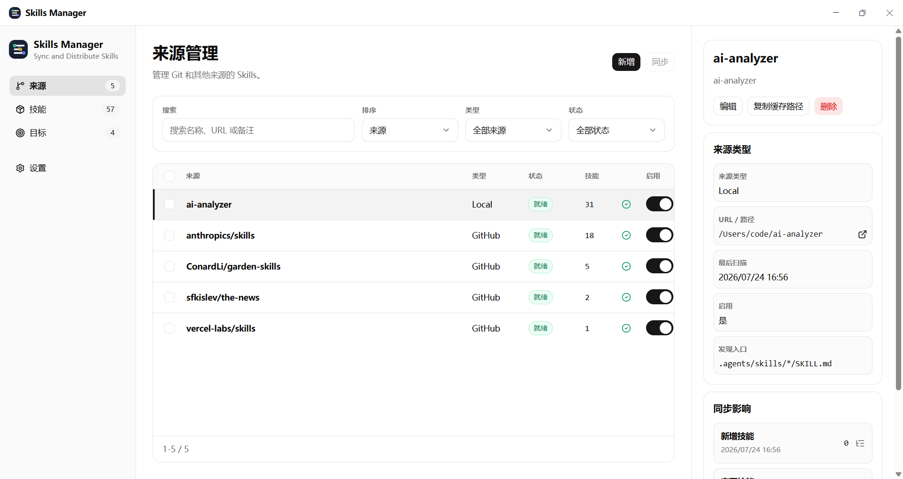
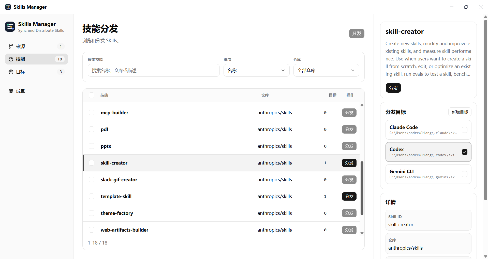
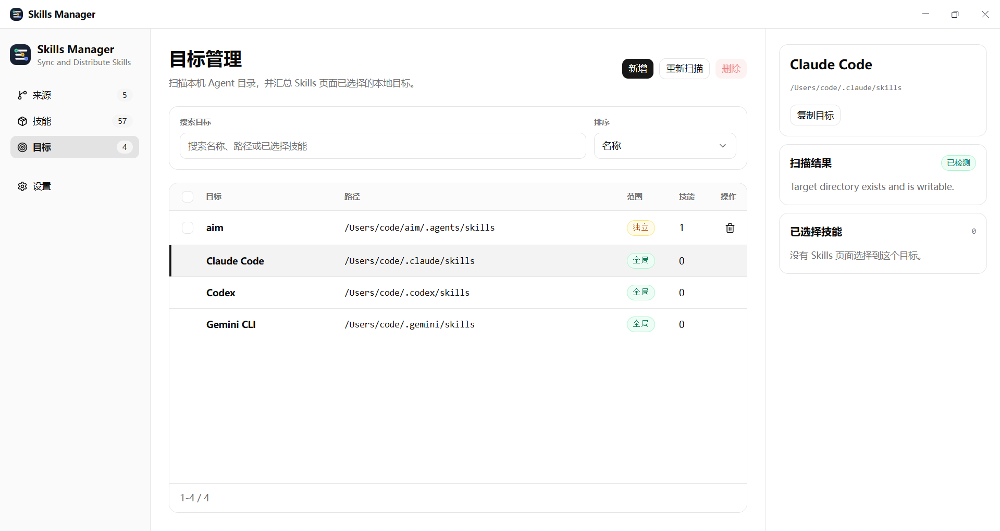

<p align="center">
  
</p>

<h1 align="center">Skills Manager</h1>

<p align="center">
  本地优先的 Agent Skill 管理工具：统一登记来源、索引 <code>SKILL.md</code>，并将技能分发到 Codex、Claude Code、Gemini CLI 或自定义目录。
</p>

<p align="center">
  <a href="https://sk.magicfuture.app">官方网站</a> ·
  <a href="https://github.com/MagicFutureApp/SkillsManager/releases/latest">下载最新版</a> ·
  <a href="https://github.com/MagicFutureApp/SkillsManager/issues">问题与建议</a> ·
  <a href="./LICENSE">许可证</a>
</p>

Skills Manager 面向同时使用多个 coding agent、维护多个项目，或需要集中管理团队技能仓库的开发者。它将散落在 Git 仓库、本地目录和不同 agent 配置目录中的技能整理为统一的 Skill 管理方式，保留来源和目标关系，再通过可预览的流程完成本地分发。

## 目录

- [界面预览](#界面预览)
- [核心功能](#核心功能)
- [产品工作流](#产品工作流)
- [下载与安装](#下载与安装)
- [技术架构](#技术架构)
- [本地开发](#本地开发)
- [如何贡献](#如何贡献)

## 界面预览

### 来源管理

登记 GitHub 或本地来源，查看同步状态、发现入口、技能数量和最近一次扫描影响，并按需手动同步。



### 技能分发

以 Skill 而不是仓库为管理单位。可以搜索、筛选、查看详情、设置多个目标，并对单个或多个 Skill 发起分发。



### 目标管理

自动扫描 Codex、Claude Code 和 Gemini CLI 的系统级 Skills 目录，也可以添加全局或项目级自定义目录。



## 核心功能

### 1. 统一管理技能来源

- 当前新增来源支持 **GitHub** 和 **Local**。
- GitHub URL 可自动解析仓库名称、默认分支、描述和常见的 `SKILL.md` 发现入口；也可以手动调整扫描入口。
- Local 来源可选择本地 Git 仓库或本地目录。同步时会复制到 Skills Manager 的统一缓存，不直接修改原目录。
- 远程同步调用用户系统中的 Git，沿用现有 SSH key、credential helper 和代理配置；应用内不实现 OAuth，也不托管 Git 凭据。
- 同步与扫描默认由用户手动触发。页面会记录成功或失败状态、错误信息，以及 added、changed、removed、warning 等摘要。
- 可以启用、停用、编辑或删除来源。删除来源会清理对应的本地索引与缓存，不会自动删除已经分发到 agent 目标目录中的文件。

### 2. 从仓库发现 Skill

- 标准业务单元是 `skill`：一个 repository 可以包含零个、一个或多个 Skill。
- 扫描器以约定式 `SKILL.md` 为入口，读取名称、描述、license、入口路径和根目录等信息，建立统一的本地索引。
- Skills 页面支持按名称、来源或描述搜索，按来源筛选，按名称或来源排序，分页浏览和当前页批量选择。

### 3. 管理多个 Agent 目标

- 自动检测 Codex、Claude Code 与 Gemini CLI 是否安装，并检查对应 Skills 目录是否存在、是否为目录及是否可写。
- 支持添加自定义目录，并区分系统级全局目标与面向单个项目的独立目标。
- 同一个 Skill 可以选择多个目标；同一个目标也可以接收多个 Skill。
- 删除目标时可以独立决定是否删除目标中的 Skill 文件。

### 4. 预览并执行分发

Skills Manager 只使用目录复制，不创建 symlink、hardlink 或 junction。一次完整分发会经历：

1. 根据 Skill 与已启用目标生成一次性预览，不写入持久化预览记录。
2. 对每个 skill-target 组合计算 `install`、`update`、`skip`、`conflict` 或 `blocked`。
3. 展示源路径、目标路径和冲突原因；冲突项允许用户选择覆盖或跳过。
4. 用户确认后，再次执行路径安全检查并复制目录。
5. 将 installed、updated、skipped、conflicts、blocked、failed 等写入当前安装结果。

路径检查会拒绝空路径、目标根目录覆盖、源与目标互相嵌套、重复目标路径等危险情况。即使用户对冲突选择覆盖，这些安全规则仍然生效。

### 5. 同步后自动分发

设置中可以开启 `同步后自动分发`。开启后，来源同步完成时只会处理本次同步涉及的 Skill；没有目标偏好的 Skill 不会被系统猜测或自动安装。该选项默认关闭。

### 6. 本地设置

- GitHub Token 用于 GitHub API 元数据与仓库树读取，可缓解匿名请求频率限制或访问有权限的仓库。当前 Token 保存在本机 SQLite 设置中，并未接入系统钥匙串；建议使用最小权限 Token 并保护好本机账户。

## 产品工作流


## 下载与安装

可从[官方网站](https://sk.magicfuture.app)或 [GitHub Releases](https://github.com/MagicFutureApp/SkillsManager/releases/latest) 下载当前版本。

| 平台       | 当前构建 | 安装包        |
| ---------- |----------| ------------- |
| Windows 11 | x64      | `skills-manager-<version>-win-x64-setup.exe`   |
| macOS      | Arm64    | `skills-manager-<version>-mac-arm64.dmg`        |
| Ubuntu     | x64      | `skills-manager-<version>-ubuntu-amd64.deb` |

### macOS（Homebrew）

macOS 用户也可以通过 Homebrew 安装：

```bash
brew tap MagicFutureApp/skills-manager https://github.com/MagicFutureApp/SkillsManager
brew install --cask skills-manager
```

首次使用建议按以下顺序操作：

1. 在“来源”中添加 GitHub URL 或本地目录。
2. 执行同步，等待应用扫描并建立 Skill 索引。
3. 在“目标”中重新扫描系统目标，或添加项目目录。
4. 在“技能”中为 Skill 勾选目标。
5. 查看分发预览，处理冲突后确认复制。

## 技术架构

### Monorepo 结构

仓库使用 pnpm workspace：

```text
.
├── apps/
│   ├── desktop/        Electron 桌面应用
│   │   ├── src/core/   可移植的扫描、来源、目标与分发类型/逻辑
│   │   ├── src/db/     Drizzle schema、SQLite client 与 repository 层
│   │   ├── src/main/   Electron 生命周期、IPC、Git 与文件系统操作
│   │   └── src/renderer/ React 页面、状态、组件与 i18n
│   ├── landing/        TanStack Start + Cloudflare Workers 网站
│   └── cache-manager/  预留的 Hono cache manager workspace
├── docs/               设计、数据模型、实施计划与 native 依赖说明
├── scripts/            发布版本辅助脚本
└── electron-builder.yml
```

`apps/cache-manager` 目前只是占位目录。Landing 的 release metadata 现阶段由 landing Worker 自己通过 Cloudflare KV 提供。

### 主要技术栈

| 区域          | 技术                                                     |
| ------------- | -------------------------------------------------------- |
| Desktop shell | Electron 41                                              |
| Desktop UI    | React 19、TypeScript 6、Vite 8、TanStack Router、Zustand |
| UI system     | Base UI、shadcn、Tailwind CSS 4、Lucide                  |
| 本地数据      | SQLite、better-sqlite3、Drizzle ORM                      |
| 国际化        | i18next、react-i18next                                   |
| 测试与质量    | Vitest、Testing Library、Prettier、TypeScript            |
| 打包与发布    | electron-builder、GitHub Actions、GitHub Releases        |

## 本地开发

### 环境要求

- Node.js 24（CI 使用版本）
- pnpm 10.23.0（根 `packageManager` 声明版本）
- 系统 Git
- 对应平台的 native build toolchain，用于需要时重建 `better-sqlite3`

### 安装依赖

```bash
git clone https://github.com/MagicFutureApp/SkillsManager.git
cd SkillsManager
pnpm install
```

`better-sqlite3` 包含 native `.node` 文件。首次安装、切换 Electron 版本或出现 `NODE_MODULE_VERSION` 不匹配时执行：

```bash
pnpm run rebuild:better-sqlite3
```

完整的 Windows、macOS 验证命令与故障排查见 [`docs/native-dependency-rebuild.md`](./docs/native-dependency-rebuild.md)。

### 启动 Desktop

```bash
pnpm run dev
```

该命令先构建 main process，再在 `http://localhost:3700` 启动 renderer dev server 并打开 Electron。验证真实桌面行为时应使用这个入口，不要只运行独立 Vite 页面。

## 常用命令

从仓库根目录执行：

| 命令                                     | 用途                                     |
| ---------------------------------------- | ---------------------------------------- |
| `pnpm run dev`                           | 构建 main 并启动 Electron 开发环境       |
| `pnpm run build`                         | 构建 desktop main 与 renderer            |
| `pnpm run build:main`                    | 仅构建 Electron main/preload             |
| `pnpm run build:renderer`                | 仅构建 desktop renderer                  |
| `pnpm run check`                         | 检查 desktop main 与 renderer TypeScript |
| `pnpm test`                              | 运行 desktop Vitest 测试                 |
| `pnpm run format`                        | 使用 Prettier 格式化 desktop 配置与源码  |
| `pnpm run format:check`                  | 检查 desktop 格式                        |
| `pnpm run db:generate`                   | 根据 Drizzle schema 生成 migration       |
| `pnpm run db:check`                      | 检查 Drizzle migration 一致性            |
| `pnpm run package:win`                   | 构建 Windows x64 NSIS 安装包             |
| `pnpm run package:mac`                   | 构建 macOS arm64 DMG                     |
| `pnpm run package:linux`                 | 构建 Ubuntu x64 DEB                      |
| `pnpm run release [patch\|minor\|major]` | 提升 desktop 版本号                      |

## 如何贡献

欢迎提交 bug 修复、可验证的体验改进、测试和文档完善。开始较大的功能前，建议先创建 Issue 说明使用场景、范围和预期行为，避免与当前版本的边界冲突。

### 开发流程

1. Fork 仓库并从最新 `main` 创建功能分支。
2. 阅读 [`AGENTS.md`](./AGENTS.md) 与相关 [`docs/superpowers/specs`](./docs/superpowers/specs)；分发行为以 copy-only 设计和当前代码为准。
3. 对行为变更、IPC/API、数据库或 UI 交互先补充能复现问题或描述新行为的测试。
4. 做最小范围修改，复用已有 helper、repository、Base UI/shadcn 组件和 i18n 资源。
5. 运行与改动范围匹配的检查，再提交 Pull Request。

### 架构约束

- Renderer 不得直接访问 Git、SQLite、Node 文件系统或操作系统命令。
- 会改变状态的操作必须通过类型化 preload/IPC 边界。
- Electron 专属逻辑放在 `apps/desktop/src/main`，可移植业务逻辑优先放在 `src/core`，数据库逻辑放在 `src/db`。
- 分发执行统一使用 copy，并解析到精确 commit；不要重新引入 symlink、持久化预览记录。
- `skill_target_preferences` 是期望，`install_instances` 才是安装事实。
- 不要提交 Token、凭据、`.dev.vars`、本机真实路径或其他私密信息。

### 验证建议

| 改动类型                 | 最低建议验证                                                               |
| ------------------------ | -------------------------------------------------------------------------- |
| 文档                     | `git diff --check -- <file>`                                               |
| TypeScript、IPC 或 API   | `pnpm run check`                                                           |
| Main process             | `pnpm run build:main` + 对应 Vitest                                        |
| Renderer 页面/交互       | 对应 `*.test.tsx`；真实桌面行为再用 `pnpm run dev`                         |
| 数据库 schema/repository | 对应 repository 测试，必要时 `pnpm run db:generate` 与 `pnpm run db:check` |

Pull Request 请说明：解决的问题、用户可见变化、关键实现取舍、验证命令及结果；涉及界面变化时附上截图或录屏。请避免无关重构、命名 churn 和大面积纯格式改写。

## 反馈与联系

- Bug 与功能建议：[GitHub Issues](https://github.com/MagicFutureApp/SkillsManager/issues)
- 一般咨询与合作：[contact@magicfuture.app](mailto:contact@magicfuture.app)
- GitHub Token 帮助：[sk.magicfuture.app/help/github-token](https://sk.magicfuture.app/help/github-token)

## License

本项目采用 **GNU Affero General Public License v3.0（AGPL-3.0）**。

- Copyright © 2026 Liang（[sk.magicfuture.app](https://sk.magicfuture.app)）
- 英文法律文本见 [`LICENSE`](./LICENSE)，中文说明见 [`LICENSE.zh.md`](./LICENSE.zh.md)。
- 修改或基于本项目创建的派生作品需要遵守 AGPL-3.0；通过网络提供修改版本时，也需要向用户提供对应源代码。
- 如需闭源或商业使用，请联系版权所有者获取单独的 **Commercial License**。
